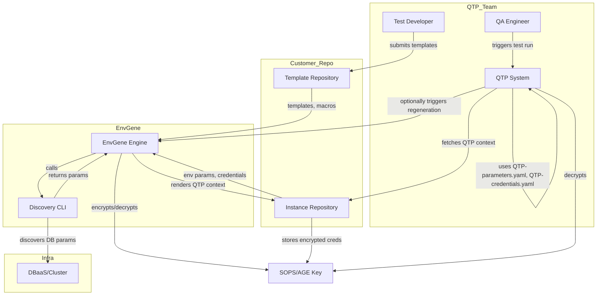

# QTP Parameter Management

- [QTP Parameter Management](#qtp-parameter-management)
  - [Terms](#terms)
  - [Problem Statement](#problem-statement)
  - [Object Model](#object-model)
  - [Diagram](#diagram)
  - [Requirements](#requirements)
  - [Use Cases](#use-cases)
  - [Proposed Approach](#proposed-approach)
    - [Template Lifecycle](#template-lifecycle)
    - [Instance Lifecycle](#instance-lifecycle)
    - [QTP-specific context](#qtp-specific-context)
    - [Sensitive Parameters Encryption](#sensitive-parameters-encryption)
    - [QTP-specific context parameters discovery](#qtp-specific-context-parameters-discovery)
  - [GAPS](#gaps)
  - [Open Questions](#open-questions)

## Terms

**Effective Set** - A structured set of configuration parameters generated by EnvGene for a specific consumer (here: QTP)
**QTP-specific context of Effective Set** - the part of the Effective Set with QTP-specific parameters
**Template Repository** - Stores common parameters for all/group of Environments
**Instance Repository** - Stores environment-specific parameters for a particular instance, as well as Effective Set
**Environment** - 

## Problem Statement

QTP, as a system for testing customer Environments, needs parameters describing these Environments and their infrastructure.

Duplicating these parameters across different configuration management (CM) systems leads to:

- Extra CM overhead
- Higher operational costs
- Risks of:
  - Human error
  - Configuration drift (desynchronization)

## Object Model


## Diagram



**Legend:**

- **Test Developer**: Authors test templates and submits them to the Template Repository
- **QA Engineer**: Triggers QTP System to run tests
- **QTP System**: Runs tests, optionally triggers Effective Set regeneration, fetches and uses QTP-specific context
- **EnvGene Engine**: Renders Effective Set, calls Discovery CLI, encrypts/decrypts credentials
- **Discovery CLI**: Discovers DB parameters, resolves macros, interacts with DBaaS/Cluster
- **Instance Repository**: Stores environment-specific parameters, Effective Set, and encrypted credentials
- **SOPS/AGE Key**: Used for encryption/decryption of sensitive parameters (not infrastructure)
- **DBaaS/Cluster**: External infrastructure for discovery

## Requirements

1. QA engineers should not manually enter QTP-specific context parameters.
2. QTP must retrieve the QTP-specific context within 5 seconds.
3. Generating QTP-specific context must only affect this context, not other Effective Set contexts.
4. QTP needs the following parameters:
   1. Cluster:
      1. cluster API URL
      2. cluster token
   2. Application:
      1. Application API URLs
      2. Credentials for API URLs
      3. Application UI URLs
      4. Credentials for UI URLs
      5. Database connection parameters:
         1. host
         2. port
         3. dbName
         4. login
         5. password

## Use Cases

1. Onboard QTP into existing customer EnvGene repositories
2. Generate QTP-specific parameter set (Effective Set)
   1. Without encryption
   2. With encryption
3. Add/modify/remove a test for a Environment

## Proposed Approach

QTP parameters are tightly coupled to tests. Only the test developer can define which parameters are needed for a specific test (e.g., which DB, endpoint ( via gateway, ingress, or service), and with which account).

Since EnvGene repositories contain:

- Inventory of customer's Environments
- Parameters describing customer's Environments

**It is proposed to** allow test developers to construct parameter values using environment-specific macros like `${CLOUD_PUBLIC_HOST}`, `${NAMESPACE}`, `${APPLICATION_NAME}`, `${SERVICE_NAME}`, `${PUBLIC_GATEWAY_URL}`, `${PRIVATE_GATEWAY_URL}`. For example:

```yaml
application-public-api-url: ${PUBLIC_GATEWAY_URL}/service-x
application-private-api-url: http://ui-service.${NAMESPACE}.${CLOUD_PRIVATE_HOST}
application-catalog-ui: ${CLOUD_API_HOST}://${CLOUD_PUBLIC_HOST}/catalog
application-admin-ui: ${CLOUD_API_HOST}://${CLOUD_PUBLIC_HOST}/admin
```

See [this page](https://github.com/Netcracker/qubership-envgene/blob/main/docs/template-macros.md) for the full list of macros and usage examples.

**It is proposed to** add macro: `${dbConnection.get('<db-classifier>').username|password|host|port|dbName}` — provides DB connection parameters, discovered via DBaaS during the discovery process.

### Template Lifecycle

Set of parameters built with macros are templates, part of the EnvGene Environment Template, and stored in the customer Template repository.

Template changes are as frequent as test changes. When a test is developed, a config template is developed for it. Test parameters are versioned together with the customer solution parameters via the EnvGene template version.

Test developers submit templates (or changes) via MR to the customer repository. When a template changes, Effective Set regeneration is triggered by the QA engineer.

### Instance Lifecycle

During Effective Set generation, templates are rendered with environment-specific parameters. Credentials are stored in the instance repository (allowing sharing across environments).

Effective Set regeneration frequency matches the environment lifecycle (on create/change). Since the customer generates the Effective Set (to get other contexts), QTP can always fetch the latest version (e.g., after credential rotation).

### QTP-specific context

**It is proposed to** Introduce a QTP-specific context in the [Effective Set](https://github.com/Netcracker/qubership-envgene/blob/feature/es_impovement_step_2/docs/calculator-cli.md#effective-set-v20), which includes a file with both sensitive and non-sensitive parameters.

QTP fetches the Effective Set for a specific environment via a contract path from the customer's instance repository. The Effective Set structure:

```text
/
└── environments
    └── <cluster-name-01>
        └── <environment-name-01>
            └── effective-set           
                ├── pipeline
                |   ├── QTP-parameters.yaml
                |   ├── QTP-credentials.yaml
                ...
```

- `QTP-parameters.yaml`: non-sensitive parameters
- `QTP-credentials.yaml`: sensitive parameters (from credential macros in the template), can be encrypted

QTP-specific context is generated as a consumer-specific context of the pipeline context, following [Pipeline Parameter Context](https://github.com/Netcracker/qubership-envgene/blob/feature/es_impovement_step_2/docs/calculator-cli.md#version-20-pipeline-parameter-context).

The structure of these files is customized via [`EFFECTIVE_SET_CONFIG`](https://github.com/Netcracker/qubership-envgene/blob/feature/es_impovement_step_2/docs/instance-pipeline-parameters.md#effective_set_config).

### Sensitive Parameters Encryption

EnvGene supports encryption of sensitive parameter values using SOPS with AGE keys. All systems working with credentials (including EnvGene and QTP) generate their own AGE key pairs. Each system encrypts using a key derived from the sum of all participants' public keys; decryption uses the system's private key.

### QTP-specific context parameters discovery


Automated discovery of some QTP-specific context parameters is proposed.

The CLI runs in the GitLab pipeline in the EnvGene Discovery repository.

The EnvGene Instance repository integrates with the Discovery repository, allowing it to receive QTP-specific parameters and generate the Effective Set QTP-specific context.

The CLI resolves macros like `${dbConnection.get('<db-classifier>').username|password|host|port|dbName}`.

**CLI inputs:**

- DBaaS endpoint URL
- DBaaS username and password
- DB classifiers

**CLI outputs (per DB classifier):**

- host
- port
- dbName
- login
- password

These parameters are retrieved via DBaaS API calls.

## GAPS

1. NS level macros works only on NS level
2. Generating QTP-specific context affects other Effective Set contexts

## Open Questions

1. What should the model for QTP-specific context in Effective Set look like?
2. How to split QA team-maintained QTP-specific parameters between Template and Instance repositories?
   1. A: All QTP-specific context parameters are env-specific and will reside in the instance repository
3. Are parameters in Customer's repository sufficient for QTP parameter generation?
   1. A: Parameters in Customer's repository are insufficient — discovery is required
4. How to ensure Requirement 1 is met?
5. Do business applications have labels for UI/API service identification?
6. Should URLs be generated or discovered via ingress?
7. What is the URL formation principle for business app API via gateway?
8. When to use public vs private gateway?
9. Is the discovery procedure secure?
10. What token permissions are required for discovery?
11. What is the naming convention for service credential secrets? Is it application-specific?
12. What authentication method is used for business app APIs?
    1. Does QTP-specific context contain login/password for QTP to obtain tokens?
