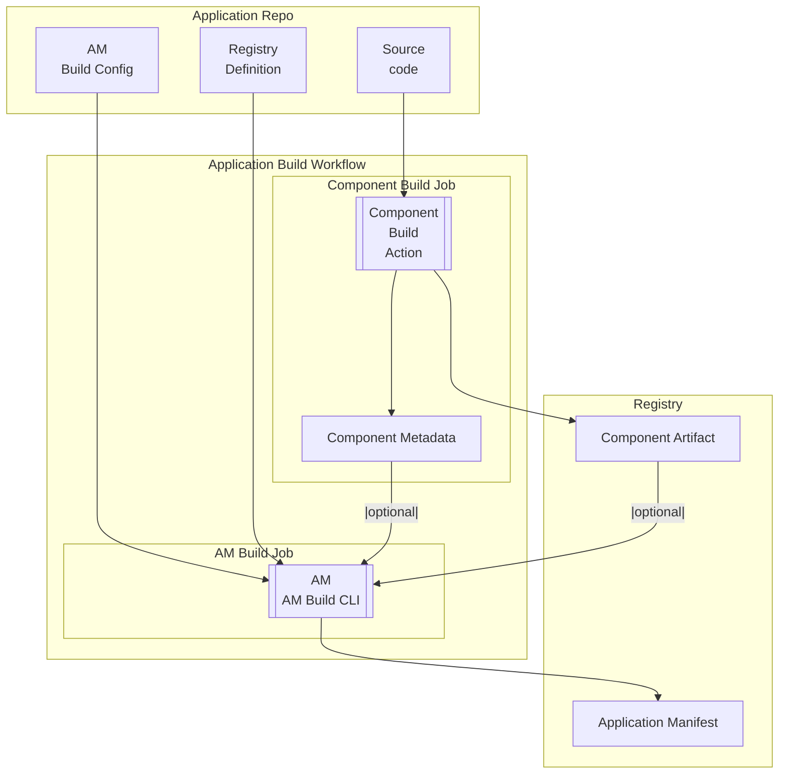

# Application Manifest Build CLI

## Table of Contents

- [Application Manifest Build CLI](#application-manifest-build-cli)
  - [Table of Contents](#table-of-contents)
  - [Proposed Approach](#proposed-approach)
  - [Limitation](#limitation)
  - [Requirements](#requirements)
  - [Application Manifest Examples](#application-manifest-examples)
    - [Simple](#simple)
    - [Jaeger](#jaeger)
    - [QIP](#qip)
  - [Application Manifest Build Config](#application-manifest-build-config)
    - [`artifactMappings` Processing](#artifactmappings-processing)
  - [Component Metadata](#component-metadata)
    - [`application/vnd.docker.image`](#applicationvnddockerimage)
    - [`application/vnd.qubership.helm.chart`](#applicationvndqubershiphelmchart)
  - [AM Build CLI execution attributes](#am-build-cli-execution-attributes)
  - [Application Manifest Structure](#application-manifest-structure)
    - [Metadata](#metadata)
    - [Components](#components)
      - [\[Components\] `application/vnd.qubership.standalone-runnable`](#components-applicationvndqubershipstandalone-runnable)
      - [\[Components\] `application/vnd.docker.image`](#components-applicationvnddockerimage)
      - [\[Components\] `application/vnd.qubership.helm.chart`](#components-applicationvndqubershiphelmchart)
        - [\[Components\] `application/vnd.qubership.helm.values.schema`](#components-applicationvndqubershiphelmvaluesschema)
        - [\[Components\] `application/vnd.qubership.resource-profile-baseline`](#components-applicationvndqubershipresource-profile-baseline)
  - [Registry Definition](#registry-definition)
  - [Artifact Reference to PURL and Vice Versa](#artifact-reference-to-purl-and-vice-versa)
    - [PURL Format](#purl-format)
    - [Artifact Reference Formats](#artifact-reference-formats)
      - [Docker and OCI Registry](#docker-and-oci-registry)
      - [GitHub Release](#github-release)
    - [Artifact Reference -\> PURL](#artifact-reference---purl)
    - [PURL -\> Artifact Reference](#purl---artifact-reference)
  - [Use Cases](#use-cases)
  - [Appendix](#appendix)
    - [References](#references)
    - [Potential Application Manifest Cases](#potential-application-manifest-cases)
    - [Potential Application Manifest Components](#potential-application-manifest-components)

## Proposed Approach

It is proposed to develop a CLI for generating the Application Manifest. The CLI will:

- Identify application components from a configuration file
- Collect component attributes from the outputs of the application component build jobs or built artifact
- Generate the Application Manifest and publish it as an artifact
- Uses the Registry Definition to form the PURL of components



## Limitation

1. The component name and component MIME type within the application must be unique
2. For each component's artifact type (Docker, Helm, Maven), application publication goes to one registry per type

## Requirements

1. The CLI must generate AM that validates against [JSON Schema](/schemas/application-manifest.schema.json)
2. The CLI must use as input [Registry Definition v2.0](/schemas/regdef-v2.schema.json)
3. For each application entity listed below, an AM component with the corresponding MIME type must be generated:
    1. "Service" -> `application/vnd.qubership.standalone-runnable`
    2. Docker image -> `application/vnd.docker.image`
    3. Helm chart -> `application/vnd.qubership.helm.chart`
4. The CLI must complete the AM build for an application with 50 components within 10 seconds
5. The CLI must support execution in both GitLab CI and GitHub Actions environments

## Application Manifest Examples

[Application Manifest JSON schema](/schemas/application-manifest.schema.json)

### Simple


[Simple Application Manifest](/examples/application-manifest.json)

### Jaeger


[Jaeger Application Manifest](/examples/application-manifest-jaeger.json)

### QIP


[QIP Application Manifest](/examples/application-manifest-qip.json)

## Application Manifest Build Config

This config file defines the set of components in the application manifest, their relationships, parameter sources, and additional attributes. It serves as an input for the AM build CLI.

The config is stored in the application repository.

```yaml
# Optional
applicationVersion: <application-version>
# Optional
applicationName: <application-name>
components:
  - # Mandatory
    # Component name
    name: <component-name>
    # Mandatory
    # Component mimeType
    mimeType: enum [ application/vnd.qubership.standalone-runnable, application/vnd.docker.image, application/vnd.qubership.helm.chart ]
    # Optional
    # If specified, the component's attributes should be collected from an external artifact.
    # Used when the AM is generated for an already built artifact that is NOT built within the same pipeline as the AM.
    # Applicable for application/vnd.docker.image and application/vnd.qubership.helm.chart.
    reference: <reference>
    # Optional
    # Used to organize relationships between components
    dependsOn:
      - # Mandatory
        # Component name
        name: <component-name>
        # Mandatory
        # Component mimeType
        mimeType: enum [ application/vnd.qubership.standalone-runnable, application/vnd.docker.image, application/vnd.qubership.helm.chart ]
        # Optional
        # See "Artifact mappings for Helm charts" for details
        valuesPathPrefix: <path-or-dot>       
```

**Simple Example:**

```yaml
applicationVersion: 1.2.3
applicationName: application
components:
  # application/vnd.qubership.standalone-runnable
  - name: a-standalone-runnable
    mimeType: application/vnd.qubership.standalone-runnable
    dependsOn:
      - name: a-helm-chart
        mimeType: application/vnd.qubership.helm.chart
  # application/vnd.qubership.helm.chart
  - name: a-helm-chart
    mimeType: application/vnd.qubership.helm.chart
    dependsOn:
      - name: a-docker-image
        mimeType: application/vnd.docker.image
  # application/vnd.docker.image
  - name: a-docker-image
    mimeType: application/vnd.docker.image
```

**Jaeger Example:**

```yaml
applicationVersion: 1.2.3
applicationName: jaeger
components:
  # application/vnd.qubership.standalone-runnable
  - name: cassandra
    mimeType: application/vnd.qubership.standalone-runnable
    dependsOn:
      - name: qubership-jaeger
        mimeType: application/vnd.qubership.helm.chart
  # application/vnd.qubership.helm.chart
  - name: qubership-jaeger
    mimeType: application/vnd.qubership.helm.chart
    dependsOn:
      - name: jaeger-cassandra-schema
        mimeType: application/vnd.docker.image
        valuesPathPrefix: cassandraSchema
      - name: jaeger
        mimeType: application/vnd.docker.image
        valuesPathPrefix: jaeger
      - name: jaeger-readiness-probe
        mimeType: application/vnd.docker.image
        valuesPathPrefix: readinessProbe
      - name: example-hotrod
        mimeType: application/vnd.docker.image
        valuesPathPrefix: exampleHotrod
      - name: jaeger-integration-tests
        mimeType: application/vnd.docker.image
        valuesPathPrefix: integrationTests
      - name: jaeger-es-index-cleaner
        mimeType: application/vnd.docker.image
        valuesPathPrefix: elasticsearch.indexCleaner
      - name: jaeger-es-rollover
        mimeType: application/vnd.docker.image
        valuesPathPrefix: elasticsearch.rollover
      - name: envoy
        mimeType: application/vnd.docker.image
        valuesPathPrefix: proxy
      - name: openjdk
        mimeType: application/vnd.docker.image
        valuesPathPrefix: .
      - name: spark-dependencies-image
        mimeType: application/vnd.docker.image
        valuesPathPrefix: spark
      - name: qubership-deployment-status-provisioner
        mimeType: application/vnd.docker.image
        valuesPathPrefix: statusProvisioner
  # application/vnd.docker.image
  - name: jaeger-cassandra-schema
    mimeType: application/vnd.docker.image
    reference: docker.io/jaegertracing/jaeger-cassandra-schema:1.72.0
  - name: jaeger
    mimeType: application/vnd.docker.image
    reference: docker.io/jaegertracing/jaeger:2.9.0
  - name: jaeger-readiness-probe
    mimeType: application/vnd.docker.image
  - name: jaeger-readiness-probe
    mimeType: application/vnd.docker.image
  - name: example-hotrod
    mimeType: application/vnd.docker.image
    reference: docker.io/jaegertracing/example-hotrod:1.72.0
  - name: jaeger-integration-tests
    mimeType: application/vnd.docker.image
  - name: jaeger-es-index-cleaner
    mimeType: application/vnd.docker.image
    reference: docker.io/jaegertracing/jaeger-es-index-cleaner:1.72.0
  - name: jaeger-es-rollover
    mimeType: application/vnd.docker.image
    reference: docker.io/jaegertracing/jaeger-es-rollover:1.72.0
  - name: envoy
    mimeType: application/vnd.docker.image
    reference: docker.io/envoyproxy/envoy:v1.32.6
  - name: openjdk
    mimeType: application/vnd.docker.image
    reference: docker.io/openjdk:11
  - name: spark-dependencies-image
    mimeType: application/vnd.docker.image
  - name: qubership-deployment-status-provisioner
    mimeType: application/vnd.docker.image
```

### `artifactMappings` Processing

For components with `mime-type: application/vnd.qubership.helm.chart`, you can define how artifact-derived parameters should be placed into Helm values. The CLI will translate this into the `qubership:helm.values.artifactMappings` property in the Application Manifest.

- Each mapping links a Docker image (or other artifact component) to a `valuesPathPrefix` under which its parameters are injected
- `artifact` should reference another component in this Build Config (by `name`)
- `valuesPathPrefix` is a dot-separated path relative to the chart values root; default is `.`

`valuesPathPrefix` will be used by EnvGene to generate Helm values for the chart in the following format:

```yaml
<valuesPathPrefix>:
  <predefined-artifact-parameter-key>: <predefined-artifact-parameter-value>
```

```yaml
statusProvisioner:
  docker_digest: e305076df2205f1e3968bc566a5ee25f185cbc82ede6d20be8a35a98b8570147
  docker_registry: registry.qubership.org:11000
  docker_repository_name: docker-image-group
  docker_tag: docker-image-version
  image_name: docker-image-name
  name: docker-image-name
  full_image_name: registry.qubership.org:11000/docker-image-group/docker-image-name:docker-image-version
  image: registry.qubership.org:11000/docker-image-group/docker-image-name:docker-image-version
jaeger:
  docker_image_digest: aa5b123cde4567890abcdef1234567890abcdef1234567890abcdef123456789
  registry_url: containers.qubership.org:12000
  repository: sample-image-group
  tag: sample-image-version
  docker_image_name: sample-docker-image
  container_name: sample-docker-image
  full_image_reference: containers.qubership.org:12000/sample-image-group/sample-docker-image:sample-image-version
  container_image: containers.qubership.org:12000/sample-image-group/sample-docker-image:sample-image-version
```

## Component Metadata

Component metadata files are JSON files containing detailed information about individual components (Docker images, Helm charts).

They are generated by component build jobs as output artifacts.

The AM Build CLI reads these files as positional parameters and uses them to enrich component information from the configuration when generating the Application Manifest.

This allows incorporating build-time attributes (hashes, versions, registry references) that are only available after the component is built.

### `application/vnd.docker.image`

```json
{
  "name": "<docker-image-name>",
  "type": "container",
  "mime-type": "application/vnd.docker.image",
  "hashes":[
    {
      "alg": "<hash-algorithm>",
      "content": "<hash-content>"
    }
  ],
  "reference": "registry_host/namespace/image_name:image_tag"
}
```

### `application/vnd.qubership.helm.chart`

```json
{
  "name": "<helm-chart-name>",
  "type": "application",
  "mime-type": "application/vnd.qubership.helm.chart",
  "reference": "oci://registry_host/namespace/chart_name:chart_version"
}
```

## AM Build CLI execution attributes

| Attribute             | Type   | Mandatory | Description                                                 | Example                                                               |
|-----------------------|--------|-----------|-------------------------------------------------------------|-----------------------------------------------------------------------|
| `--config`/`-c`       | string | yes       | Path to the Application Manifest Build configuration file   | `/path/to/am-build-config.yml`                                        |
| `--version`/`-v`      | string | no        | Application version                                         | `1.2.3`                                                               |
| `--name`/`-n`         | string | mp        | Application name                                            | `my-application`                                                      |
| `--out`/`-o`          | string | yes       | Path where to save the generated Application Manifest       | `/path/to/output/application-manifest.json`                           |
| positional parameters | string | yes       | Paths to component metadata files as positional parameters  | `/path/to/component1-metadata.json /path/to/component2-metadata.json` |

## Application Manifest Structure

> [!IMPORTANT]
>
> When a required attribute is missing in the AM
>
> Mandatory Attributes:
> If a default exists: The default value is applied  
> If no default exists: Throws readable error
>
> Optional Attributes:
> If a default exists: The default value is applied  
> If no default exists: The attribute remains unset

### Metadata

Describes Application Manifest metadata.

| Attribute                     | Type   | Mandatory | Default                                 | Description                                       |
|-------------------------------|--------|-----------|-----------------------------------------|---------------------------------------------------|
| `timestamp`                   | string | yes       | None                                    | Specifies the date and time of the AM creation    |
| `component`                   | object | yes       | None                                    | Describes the application itself                  |
| `component.type`              | string | yes       | `application`                           | Type of the component                             |
| `component.mime-type`         | string | yes       | `application/vnd.qubership.application` | Mime-type of the component                        |
| `component.bom-ref`           | string | yes       | None                                    | Unique component identifier within the AM         |
| `component.name`              | string | yes       | None                                    | Name of the application                           |
| `component.version`           | string | yes       | None                                    | Version of the application                        |
| `tools`                       | object | yes       | None                                    | The tool(s) used to create the AM                 |
| `tools.components`            | array  | yes       | `[]`                                    | A list of components used as tools                |
| `tools.components[n].type`    | string | yes       | `application`                           | Type of the tool component                        |
| `tools.components[n].name`    | string | yes       | `am-build-cli`                          | Name of the tool component (e.g., `am-build-cli`) |
| `tools.components[n].version` | string | yes       | None                                    | Version of the tool component                     |

### Components

#### [Components] `application/vnd.qubership.standalone-runnable`

An abstract component necessary to link artifacts of different types together

| Attribute       | Type   | Mandatory | Default                                        | Description                                |
|-----------------|--------|-----------|------------------------------------------------|--------------------------------------------|
| `bom-ref`       | string | yes       | None                                           | Unique component identifier within the AM  |
| `type`          | string | yes       | `application`                                  | Component type                             |
| `mime-type`     | string | yes       | `application/vnd.qubership.standalone-runnable`| Component MIME type                        |
| `name`          | string | yes       | None                                           | Component name                             |
| `properties`    | array  | no        | `[]`                                           | Always `[]`                                |
| `components`    | array  | yes       | `[]`                                           | Always `[]`                                |

#### [Components] `application/vnd.docker.image`

Describes Docker image as an artifact

| Attribute       | Type   | Mandatory | Default                        | Description                                                          |
|-----------------|--------|-----------|--------------------------------|----------------------------------------------------------------------|
| `bom-ref`       | string | yes       | None                           | Unique component identifier within the AM                            |
| `type`          | string | yes       | `container`                    | Component type                                                       |
| `mime-type`     | string | yes       | `application/vnd.docker.image` | Component MIME type                                                  |
| `name`          | string | yes       | None                           | Docker image name                                                    |
| `group`         | string | yes       | None                           | Group or namespace for the image (empty string if none)              |
| `version`       | string | yes       | None                           | Docker image version (tag)                                           |
| `purl`          | string | yes       | None                           | Package URL (PURL) for the image                                     |
| `hashes`        | array  | yes       | None                           | List of hashes for the image (empty array if none)                   |
| `hashes.alg`    | string | yes       | None                           | Hash algorithm, e.g., "SHA-256" (required if hash present)           |
| `hashes.content`| string | yes       | None                           | Hash value as a hex string (required if hash present)                |

#### [Components] `application/vnd.qubership.helm.chart`

Root components of this type describe Helm Chart artifact, nested helm charts describe abstract helm charts (this is necessary to properly form values.yaml)

| Attribute                  | Type    | Mandatory | Default                                  | Description                                                                 |
|----------------------------|---------|-----------|------------------------------------------|-----------------------------------------------------------------------------|
| `bom-ref`                  | string  | yes       | None                                     | Unique component identifier within the AM                                   |
| `type`                     | string  | yes       | `application`                            | Component type                                                              |
| `mime-type`                | string  | yes       | `application/vnd.qubership.helm.chart`   | Component MIME type                                                         |
| `name`                     | string  | yes       | None                                     | Helm chart name                                                             |
| `version`                  | string  | yes       | None                                     | Helm chart version                                                          |
| `purl`                     | string  | no        | None                                     | Package URL (PURL) for the chart                                            |
| `hashes`                   | array   | no        | None                                     | List of hashes for the chart (empty array if none)                          |
| `hashes.alg`               | string  | yes       | None                                     | Hash algorithm, e.g., "SHA-256" (required if hash present)                  |
| `hashes.content`           | string  | yes       | None                                     | Hash value as a hex string (required if hash present)                       |
| `properties`               | array   | yes       | None                                     | List of additional properties                                               |
| `properties[n].name`       | string  | yes       | `isLibrary`                              | Set to `isLibrary`                                                          |
| `properties[n].value`      | boolean | yes       | None                                     | Indicates if the chart is a library chart                                   |
| `properties[n].name`       | string  | no        | `qubership:helm.values.artifactMappings` | Mapping name used to bind artifacts to values                               |
| `properties[n].value`      | object  | no        | `{}`                                     | Object mapping `<artifact-ref> -> { valuesPathPrefix }`                     |
| `components`               | array   | no        | `[]`                                     | Nested components. May include values schema data and/or nested charts      |

| Child Component            | Type    | Mandatory | Default                                  | Description                                                                 |
|----------------------------|---------|-----------|------------------------------------------|-----------------------------------------------------------------------------|
| `components[0]`            | object  | no        | None                                     | Child `application/vnd.qubership.helm.values.schema` component              |
| `components[1]`            | object  | no        | None                                     | Child `application/vnd.qubership.resource-profile-baseline` component       |
| `components[n]`            | object  | no        | None                                     | Child `application/vnd.qubership.helm.chart` component                      |

##### [Components] `application/vnd.qubership.helm.values.schema`

Describes JSON Schema for Helm chart values embedded as data entries.

The schema is located at `charts/<chart-name>/values.schema.json` in the chart artifact, at the same level as `Chart.yaml`.  
The schema is optional for the chart; if no schema exists at this path, the AM build CLI does not add a child component and AM generation completes successfully.  

| Attribute                  | Type   | Mandatory | Default                                        | Description                                                    |
|----------------------------|--------|-----------|------------------------------------------------|----------------------------------------------------------------|
| `bom-ref`                  | string | yes       | None                                           | Unique component identifier within the AM                      |
| `type`                     | string | yes       | `data`                                         | Component type                                                 |
| `mime-type`                | string | yes       | `application/vnd.qubership.helm.values.schema` | Component MIME type                                            |
| `name`                     | string | yes       | `values.schema.json`                           | Logical name                                                   |
| `data`                     | array  | yes       | `[]`                                           | List of configuration entries                                  |
| `data[n].type`             | string | yes       | `configuration`                                | Entry type                                                     |
| `data[n].name`             | string | yes       | `values.schema.json`                           | Filename of the schema                                         |
| `data[n].contents`         | object | yes       | None                                           | Wrapper for the attachment                                     |
| `contents.attachment`      | object | yes       | None                                           | Embedded file payload                                          |
| `attachment.contentType`   | string | yes       | `application/json`                             | MIME of payload                                                |
| `attachment.encoding`      | string | no        | `base64`                                       | Encoding of the payload                                        |
| `attachment.content`       | string | yes       | None                                           | Base64-encoded schema contents                                 |

##### [Components] `application/vnd.qubership.resource-profile-baseline`

Describes a set of sized resource profile baselines that are embedded into the AM as configuration data entries.

The resource profile baselines are located at `charts/<chart-name>/resource-profiles/` in the chart artifact, at the same level as `Chart.yaml`.  
Any `yaml` or `json` file located in this folder is considered a resource profile.  
The structure of resource profile baselines is not specified; any valid `yaml` or `json` file is considered a valid resource profile.  
The resource profile baselines are optional; if no baselines exist at this path, the AM build CLI does not add a child component and AM generation completes successfully.  

| Attribute                          | Type   | Mandatory | Default                                               | Description                                                    |
|------------------------------------|--------|-----------|-------------------------------------------------------|----------------------------------------------------------------|
| `bom-ref`                          | string | yes       | None                                                  | Unique component identifier within the AM                      |
| `type`                             | string | yes       | `data`                                                | Component type                                                 |
| `mime-type`                        | string | yes       | `application/vnd.qubership.resource-profile-baseline` | Component MIME type                                            |
| `name`                             | string | yes       | `resource-profile-baselines`                          | Logical name of the bundle                                     |
| `data`                             | array  | yes       | None                                                  | List of configuration entries (see below)                      |
| `data[n].type`                     | string | yes       | `configuration`                                       | Entry type                                                     |
| `data[n].name`                     | string | yes       | None                                                  | Filename of the baseline, e.g. `small.yaml`, `dev.yaml`        |
| `data[n].contents`                 | object | yes       | None                                                  | Wrapper for the attachment                                     |
| `data[n].contents.attachment`      | object | yes       | None                                                  | Embedded file payload                                          |
| `data[n].attachment.contentType`   | string | yes       | None                                                  | MIME of payload, e.g. `application/yaml`, `application/json`   |
| `data[n].attachment.encoding`      | string | yes       | `base64`                                              | Encoding of the payload                                        |
| `data[n].attachment.content`       | string | yes       | None                                                  | Base64-encoded file contents                                   |

> [!NOTE]
>
> - `data` holds multiple size profiles (e.g., `small.yaml`, `medium.yaml`, `large.yaml`) or environment profiles (`dev.yaml`, `prod.yaml`).
> - The payload is stored inline using base64 and should decode to a valid YAML or JSON document consistent with `contentType`.

## Registry Definition

Registry configuration where in particular in the sections:

- `dockerConfig` describes the registry configuration where Docker artifacts are stored
- `helmAppConfig` describes the registry configuration where Helm artifacts are stored

Each individual registry is described by a separate `yaml` file in the `/configurations/RegDefs/` folder in the source code repository.

The `name` attribute must match the filename without the extension.

[Registry Definition v2.0](/schemas/regdef-v2.schema.json)

[Example](/examples/sandbox.yml)

[Qubership Example](/examples/qubership.yml)

## Artifact Reference to PURL and Vice Versa

The CLI needs to convert between artifact references (standard URLs) and Package URLs (PURLs) for different purposes:

- **Artifact Reference → PURL**: When generating the Application Manifest, the CLI converts artifact references (e.g., `docker.io/namespace/image:tag`) to PURLs (e.g., `pkg:docker/namespace/image@tag?registry_name=docker-hub`) to store them in the manifest. This conversion uses Registry Definition to determine the `registry_name` qualifier.

- **PURL → Artifact Reference**: When processing external artifacts specified by PURL in the configuration file, or when downloading artifacts (e.g., Helm charts), the CLI converts PURLs back to artifact references to interact with registries and tools that require standard URLs.

The conversion process relies on Registry Definitions to map between registry identifiers (`registry_name` in PURL) and actual registry URLs and parameters.

### PURL Format

```text
pkg:[TYPE]/[NAMESPACE]/[NAME]@[VERSION]?[QUALIFIERS]
```

`pkg:` - prefix indicating this is a Package URL  
`TYPE` - artifact type (`docker`, `helm`, `github`)  
`NAMESPACE` - group or organization  
`NAME` - artifact name  
`@VERSION` - version  
`?QUALIFIERS` - additional qualifiers  

> [!NOTE]
> We use for qualifiers:
>
> 1. `registry_name` - registry reference for each `TYPE`
> 2. `file_name` - filename, only for `TYPE: github`

### Artifact Reference Formats

#### Docker and OCI Registry

For Docker images:

```text
REGISTRY_HOST[:PORT]/NAMESPACE/IMAGE:TAG
```

| Field            | Type   | Mandatory | Default    | Description                   |
|------------------|--------|-----------|------------|-------------------------------|
| `REGISTRY_HOST`  | string | yes       | `docker.io`| Docker registry host          |
| `PORT`           | number | no        | 443        | Docker registry port          |
| `NAMESPACE`      | string | yes       | None       | Group or organization         |
| `IMAGE`          | string | yes       | None       | Docker image name             |
| `TAG`            | string | yes       | latest     | Image version                 |

For Helm charts:

```text
oci://REGISTRY_HOST[:PORT]/NAMESPACE/IMAGE:TAG
```

| Field             | Type   | Mandatory | Default | Description                     |
|-------------------|--------|-----------|---------|---------------------------------|
| `oci://`          | string | yes       | None    | prefix for OCI registry         |
| `REGISTRY_HOST`   | string | yes       | None    | OCI registry host               |
| `PORT`            | number | no        | 443     | OCI registry port               |
| `NAMESPACE`       | string | yes       | None    | group or organization           |
| `IMAGE`           | string | yes       | None    | Helm chart name                 |
| `TAG`             | string | yes       | None    | chart version                   |

#### GitHub Release

For Helm charts:

```text
REGISTRY_HOST[:PORT]/OWNER/REPO/releases/download/TAG/ARTIFACT-FILE
```

| Field             | Type   | Mandatory | Default | Description                     |
|-------------------|--------|-----------|---------|---------------------------------|
| `OWNER`           | string | yes       | None    | Repository owner                |
| `REPO`            | string | yes       | None    | Repository name                 |
| `TAG`             | string | yes       | None    | Release tag                     |
| `ARTIFACT-FILE`   | string | yes       | None    | Artifact filename              |

### Artifact Reference -> PURL

1. **Determining `TYPE` for PURL**

    If Artifact Reference contains `https://github.com/` - `github`  
    Then by `mime-type` from [AM Build Config or Component Metadata](#proposed-approach) - `docker`, `helm`

2. **Parsing Artifact Reference**

    Extract `REGISTRY_HOST[:PORT]`, `NAMESPACE`, `IMAGE`, `TAG` for `docker`, `helm`  
    Extract `REGISTRY_HOST[:PORT]`, `OWNER`, `REPO`, `TAG`, `ARTIFACT-FILE` for `github`

3. **Finding `registry_name` (one of `?QUALIFIERS`)**

    Find Registry Definition where the values

    For `docker`

   - `dockerConfig.groupUri`/`dockerConfig.groupName`

    For `github`

   - `githubReleaseConfig.repositoryDomainName`/`githubReleaseConfig.owner`/`githubReleaseConfig.repository`

    For `helm`

   - `helmAppConfig.repositoryDomainName`/`helmAppConfig.helmGroupRepoName`

    Match with `oci://REGISTRY_HOST[:PORT]/NAMESPACE` (for `helm`) or `REGISTRY_HOST[:PORT]/NAMESPACE` (for `docker`) or `https://github.com/OWNER/REPO` (for `github`)

    The value of the `name` attribute of such registry will be the target value for `?QUALIFIERS` (`registry_name`)

4. **Build PURL**

    | PURL Parameter | Value Source                                                                                       |
    |----------------|----------------------------------------------------------------------------------------------------|
    | `TYPE`         | from Step 1                                                                                        |
    | `NAMESPACE`    | from Step 2. `NAMESPACE` (for `docker`, `helm`) or `OWNER` (for `github`)                          |
    | `NAME`         | from Step 2. `IMAGE` (for `docker`, `helm`) or `REPO` (for `github`)                               |
    | `@VERSION`     | from Step 2. `TAG`                                                                                 |
    | `?QUALIFIERS`  | from Step 3. `registry_name=<>` and from Step 2 `file_name=<>` `ARTIFACT-FILE` (only for `github`) |

**Examples:**

- `<qubership-host>/core/qubership-core:2.1.0` -> `pkg:docker/core/qubership-core@2.1.0?registry_name=qubership`
- `https://github.com/Netcracker/qubership-airflow/releases/download/2.0.1/airflow-1.19.0-dev.tgz` -> `pkg:github/Netcracker/qubership-airflow@2.0.1?registry_name=qubership&file_name=airflow-1.19.0-dev.tgz`
- `oci://<qubership-host>/app-team/service-api:v3.2.1` -> `pkg:helm/app-team/service-api@v3.2.1?registry_name=qubership`

### PURL -> Artifact Reference

1. **Parse PURL**

    Extract `TYPE`, `NAMESPACE`, `NAME`, `@VERSION`, `?QUALIFIERS`, `#SUBPATH`

2. **Determine `REGISTRY_HOST[:PORT]`**

    Based on `TYPE` and `?QUALIFIERS` `registry_name` determine:

    For `docker`

   - `dockerConfig.groupUri`/`dockerConfig.groupName`

    For `github`

   - `githubReleaseConfig.repositoryDomainName`/`githubReleaseConfig.owner`/`githubReleaseConfig.repository`

    For `helm`

   - `helmAppConfig.repositoryDomainName`/`helmAppConfig.helmGroupRepoName`

3. **Build Artifact Reference**

    | Artifact Reference Parameter | Value Source                                         |
    |------------------------------|------------------------------------------------------|
    | `oci://`                     | for (`helm`)                                         |
    | `REGISTRY_HOST[:PORT]`       | From Step 2                                          |
    | `NAMESPACE`                  | `NAMESPACE` from PURL (for `docker` and `helm`)      |
    | `IMAGE`                      | `NAME` from PURL (for `docker` and `helm`)           |
    | `TAG`                        | `@VERSION` from PURL (for `docker` and `helm`)       |
    | `OWNER`                      | `NAMESPACE` from PURL (for `github`)                 |
    | `REPO`                       | `NAME` from PURL (for `github`)                      |
    | `TAG`                        | `@VERSION` from PURL (for `github`)                  |
    | `ARTIFACT-FILE`              | `?QUALIFIERS` `&file_name=` from PURL (for `github`) |

**Examples:**

- `pkg:docker/envoyproxy/envoy:v1.32.6?registry_name=qubership`-> `<qubership-host>/envoyproxy/envoy:v1.32.6`
- `pkg:github/Netcracker/qubership-airflow@2.0.1?registry_name=qubership&file_name=airflow-1.19.0-dev.tgz`-> `https://github.com/Netcracker/qubership-airflow/releases/download/2.0.1/airflow-1.19.0-dev.tgz`
- `pkg:helm/netcracker/qubership-core@2.1.0?registry_name=qubership`-> `oci://<qubership-host>/netcracker/qubership-core:2.1.0`

## Use Cases

1. Building a multi-component application with:
   1. `application/vnd.qubership.standalone-runnable`
   2. Docker images
      1. By source:
         1. Local (built as part of current build process)
         2. External (built as part of another build process)
         3. Mixed (combination of local and external images)
   3. Helm charts
      1. By source:
         1. Local (built as part of current build process)
         2. External (built as part of another build process)
         3. Mixed (combination of local and external charts)
      2. By structure:
         1. One umbrella chart per application
         2. One non-umbrella chart per application
         3. Multiple non-umbrella charts per application
2. Publishing the Application Manifest
   1. To OCI registry
   2. As build artifact

## Appendix

### References

1. [Application Manifest Build CLI](https://github.com/borislavr/qubership-app-manifest-cli)
2. [Application repository with configured Application Manifest build](https://github.com/borislavr/qubership-jaeger)

### Potential Application Manifest Cases


### Potential Application Manifest Components


