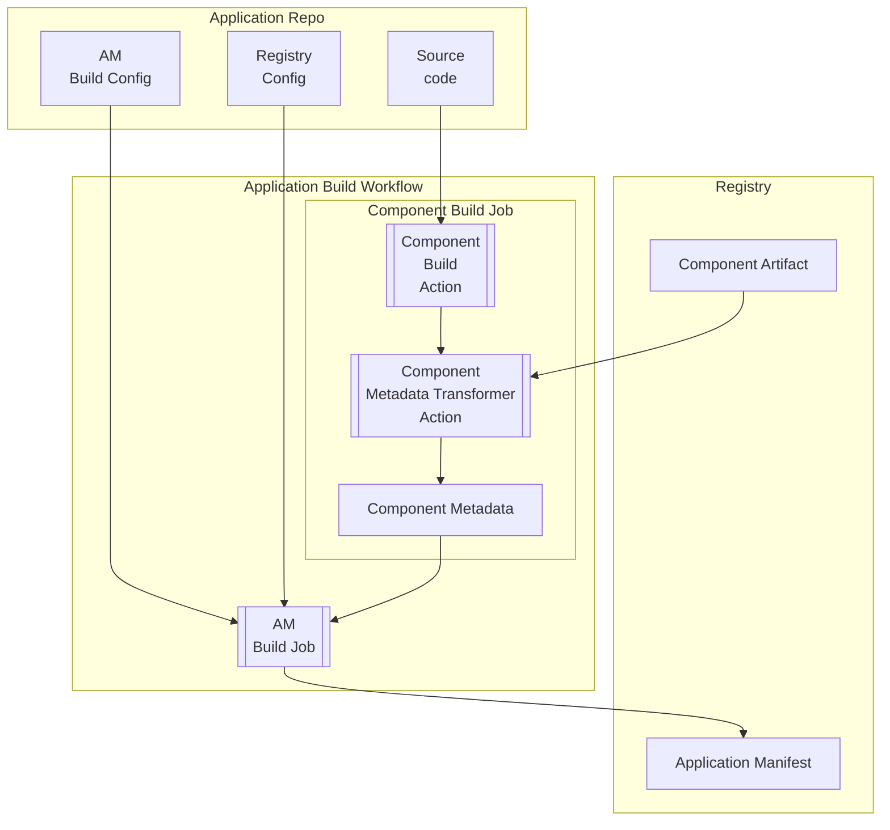

# Application Manifest Build CLI

## Table of Contents

- [Application Manifest Build CLI](#application-manifest-build-cli)
  - [Table of Contents](#table-of-contents)
  - [Proposed Approach](#proposed-approach)
  - [Use Cases](#use-cases)
  - [Open Question](#open-question)
  - [Limitation](#limitation)
  - [Requirements](#requirements)
  - [Application Manifest Examples](#application-manifest-examples)
    - [Simple](#simple)
    - [Jaeger](#jaeger)
    - [QIP](#qip)
  - [Application Manifest Build Config](#application-manifest-build-config)
    - [`helm-values-artifact-mappings` Processing](#helm-values-artifact-mappings-processing)
  - [Application Manifest Structure](#application-manifest-structure)
    - [Metadata](#metadata)
    - [Components](#components)
      - [\[Components\] `application/vnd.qubership.standalone-runnable`](#components-applicationvndqubershipstandalone-runnable)
      - [\[Components\] `application/vnd.docker.image`](#components-applicationvnddockerimage)
      - [\[Components\] `application/vnd.qubership.helm.chart`](#components-applicationvndqubershiphelmchart)
      - [\[Components\] `application/vnd.qubership.helm.values.schema`](#components-applicationvndqubershiphelmvaluesschema)
      - [\[Components\] `application/vnd.qubership.resource-profile-baseline`](#components-applicationvndqubershipresource-profile-baseline)
  - [Registry Config](#registry-config)

## Proposed Approach

It is proposed to develop a CLI for generating the Application Manifest. The CLI will:

- Identify application components from a configuration file
- Collect component attributes from the outputs of the application component build jobs or built artifact
- Generate the Application Manifest and registry configuration file and publish it as an artifact



## Use Cases

1. Building a multi-service application with:
   1. Docker images
      1. External (built as part of another build process)
   2. Helm charts
      1. One umbrella chart per application
      2. One non-umbrella chart per application
      3. Multiple non-umbrella charts
      4. External (built as part of another build process) non-umbrella charts
2. Publishing the Application Manifest
3. Build only the Application Manifest when component artifacts already exist
4. Build AM when only a single component has been updated

## Open Question

1. How does Build CLI determine the list of components to include in the Application Manifest (AM)?
   1. Configuration file as input
   2. Automatic discovery from the build workflow
   3. Automatic discovery from the application repository
2. In what format should the CLI receive component attributes from the outputs of component build jobs? Should there be a standard schema for these outputs?
3. How should the CLI identify which build job output to use for generating each specific component in the manifest?
   1. Is there a mapping mechanism or naming convention that should be followed?
   2. How should conflicts or ambiguities be resolved if multiple jobs produce similar outputs?
4. How should the CLI handle cases where the application includes a component that is a dependency, such as a Helm library?
5. Is the registry configuration an input contract, an output contract, or both?
    **A:** The registry configuration is primarily an input contract: it tells the CLI where to publish artifacts and how to authenticate. However, the CLI generate or update registry-related output files for downstream use.
6. Which Docker image tag should be used for the Docker image component?
7. How to ensure that changes to the job/action that builds components (since job outputs read by CLI are different and not contracted) don't require rewriting the build CLI?
   1. By using a standard output schema for all build jobs and using the config file to map outputs to manifest components, the CLI can remain decoupled from specific job implementations. Any changes in job outputs should be reflected in the config file or in the output schema, not in the CLI code itself?

## Limitation

1. The component name within the application must be unique
2. For each component's artifact type (Docker, Helm, Maven), application publication goes to one registry per type

## Requirements

1. The CLI must generate AM that validates against [JSON Schema](/schemas/application-manifest.schema.json)
2. The CLI must generate registry config that validates against [JSON Schema](https://github.com/Netcracker/qubership-envgene/blob/feature/reg-def-v2/schemas/regdef-v2.schema.json)
3. AM must be published as OCI artifact
   1. Artifact ID must match the application name
   2. Registry parameters for publishing (URL, credentials, group) must be get from Registry Config
4. For each application entity listed below, an AM component with the corresponding MIME type must be generated:
    1. Service -> `application/vnd.qubership.standalone-runnable`
    2. Docker image -> `application/vnd.docker.image`
    3. Helm chart -> `application/vnd.qubership.helm.chart`
    <!-- 4. ZIP archive -> `application/zip` -->
5. The CLI must complete the AM build for an application with 50 components within 10 seconds
6. The CLI must support execution in both GitLab CI and GitHub Actions environments

## Application Manifest Examples

[Application Manifest JSON schema](/schemas/application-manifest-with-plugins.schema.json)

### Simple


[Simple Application Manifest](/examples/application-manifest.json)

### Jaeger


[Jaeger Application Manifest](/examples/application-manifest-jaeger.json)

### QIP


[QIP Application Manifest](/examples/application-manifest-qip.json)

## Application Manifest Build Config

This config file defines the set of components in the application manifest, their relationships, parameter sources, and additional attributes. It serves as an input for the AM build CLI.

The config is stored in the application repository.

```yaml
# Mandatory
# Application Manifest == Application version
version: 1.2.3
components:
  - # Mandatory
    # Component name
    name: <component-name>
    # Mandatory
    # Component mimeType
    mimeType: enum [ application/vnd.qubership.standalone-runnable, application/vnd.docker.image, application/vnd.qubership.helm.chart ]
    # Optional
    # If specified, the component's attributes should be collected from an external artifact.
    # Used when the AM is generated for an already built artifact that is NOT built within the same pipeline as the AM.
    # Applicable for application/vnd.docker.image and application/vnd.qubership.helm.chart.
    purl: pkg:<type>/<group>/<name>:<version>?registryName=<registry-id>
    # Optional
    # Used to organize relationships between components
    dependsOn:
      - component: <component-name>
        mimeType: <mime-type>
        # Optional
        # See "Artifact mappings for Helm charts" for details
        valuesPathPrefix: <path-or-dot>       
```

**Simple Example:**

```yaml
version: 1.2.3
components:
  # application/vnd.qubership.standalone-runnable
  - name: a-standalone-runnable
    mimeType: application/vnd.qubership.standalone-runnable
    dependsOn:
      - name: a-helm-chart
        mimeType: application/vnd.qubership.helm.chart
  # application/vnd.qubership.helm.chart
  - name: a-helm-chart
    mimeType: application/vnd.qubership.helm.chart
    dependsOn:
      - name: a-docker-image
        mimeType: application/vnd.docker.image
  # application/vnd.docker.image
  - name: a-docker-image
    mimeType: application/vnd.docker.image
```

**Jaeger Example:**

```yaml
version: 1.2.3
components:
  # application/vnd.qubership.standalone-runnable
  - name: cassandra
    mimeType: application/vnd.qubership.standalone-runnable
    dependsOn:
      - name: qubership-jaeger
        mimeType: application/vnd.qubership.helm.chart
  # application/vnd.qubership.helm.chart
  - name: qubership-jaeger
    mimeType: application/vnd.qubership.helm.chart
    dependsOn:
      - name: jaeger-cassandra-schema
        mimeType: application/vnd.docker.image
        valuesPathPrefix: cassandraSchema
      - name: jaeger
        mimeType: application/vnd.docker.image
        valuesPathPrefix: jaeger
      - name: jaeger-readiness-probe
        mimeType: application/vnd.docker.image
        valuesPathPrefix: readinessProbe
      - name: example-hotrod
        mimeType: application/vnd.docker.image
        valuesPathPrefix: exampleHotrod
      - name: jaeger-integration-tests
        mimeType: application/vnd.docker.image
        valuesPathPrefix: integrationTests
      - name: jaeger-es-index-cleaner
        mimeType: application/vnd.docker.image
        valuesPathPrefix: elasticsearch.indexCleaner
      - name: jaeger-es-rollover
        mimeType: application/vnd.docker.image
        valuesPathPrefix: elasticsearch.rollover
      - name: envoy
        mimeType: application/vnd.docker.image
        valuesPathPrefix: proxy
      - name: openjdk
        mimeType: application/vnd.docker.image
        valuesPathPrefix: .
      - name: spark-dependencies-image
        mimeType: application/vnd.docker.image
        valuesPathPrefix: spark
      - name: qubership-deployment-status-provisioner
        mimeType: application/vnd.docker.image
        valuesPathPrefix: statusProvisioner
  # application/vnd.docker.image
  - name: jaeger-cassandra-schema
    mimeType: application/vnd.docker.image
    purl: pkg:docker/jaegertracing/jaeger-cassandra-schema:1.72.0?registryName=sandbox
  - name: jaeger
    mimeType: application/vnd.docker.image
    purl: pkg:docker/jaegertracing/jaeger:2.9.0?registryName=sandbox
  - name: jaeger-readiness-probe
    mimeType: application/vnd.docker.image
  - name: jaeger-readiness-probe
    mimeType: application/vnd.docker.image
  - name: example-hotrod
    mimeType: application/vnd.docker.image
    purl: pkg:docker/jaegertracing/example-hotrod:1.72.0?registryName=sandbox
  - name: jaeger-integration-tests
    mimeType: application/vnd.docker.image
  - name: jaeger-es-index-cleaner
    mimeType: application/vnd.docker.image
    purl: pkg:docker/jaegertracing/jaeger-es-index-cleaner:1.72.0?registryName=sandbox
  - name: jaeger-es-rollover
    mimeType: application/vnd.docker.image
    purl: pkg:docker/jaegertracing/jaeger-es-rollover:1.72.0?registryName=sandbox
  - name: envoy
    mimeType: application/vnd.docker.image
    purl: pkg:docker/envoyproxy/envoy:v1.32.6?registryName=sandbox
  - name: openjdk
    mimeType: application/vnd.docker.image
    purl: openjdk:11 ### ????
  - name: spark-dependencies-image
    mimeType: application/vnd.docker.image
  - name: qubership-deployment-status-provisioner
    mimeType: application/vnd.docker.image
```

**QIP Example:**

```yaml
```

### `helm-values-artifact-mappings` Processing

For components with `mime-type: application/vnd.qubership.helm.chart`, you can define how artifact-derived parameters should be placed into Helm values. The CLI will translate this into the `qubership:helm.values.artifactMappings` property in the Application Manifest.

- Each mapping links a Docker image (or other artifact component) to a `valuesPathPrefix` under which its parameters are injected
- `artifact` should reference another component in this Build Config (by `name`)
- `valuesPathPrefix` is a dot-separated path relative to the chart values root; default is `.`

Notes:

- The CLI will resolve `artifact` to the artifact component's identifier and emit AM attribute `qubership:helm.values.artifactMappings` accordingly
- Ensure the Helm chart component declares `dependsOn` to each referenced artifact component

<!-- ## Output Transformer

The output transformer must obtain information from the built artifact OR build job artifact.

The output transformer must produce the same output for a specific `mime-type` regardless of the action used to build the component.

Below are the supported `mime-type` values: -->

<!-- ### `application/vnd.docker.image`

```yaml
# Always `container`
# Mandatory. No default
type: container
# Always `application/vnd.docker.image`
# Mandatory. No default
mime-type: application/vnd.docker.image
# Mandatory. No default
name: my-docker-image
# Mandatory. No default
group: core
# Mandatory. No default
version: build22
purl: pkg:docker/<group>/<name>@<version>?registryName=<pointer-to-registry-in-registry-config>
# Always `[]`
# Mandatory. No default
properties: []
```

### `application/vnd.qubership.helm.chart`

```yaml
# Always `application`
# Mandatory. No default
type: application
# Always `application/vnd.qubership.helm.chart`
# Mandatory. No default
mime-type: application/vnd.qubership.helm.chart
# `name` attribute of the Helm Chart artifact
# Mandatory. No default
name: my-chart
# Mandatory. No default
version: 1.2.3
# Mandatory. No default
purl: pkg:helm/<group>/<name>@<version>?registryName=<pointer-to-registry-in-registry-config>
# Mandatory. No default
properties:
  # Set if the chart has a child chart
  - name: isUmbrella
    value: true
# In case of umbrella chart for each child chart nested component should be created 
# Mandatory. Default - []
components:
  - # Always `application`
    # Mandatory. No default
    type: application
    # Always `application/vnd.qubership.helm.chart`
    # Mandatory. No default
    mime-type: application/vnd.qubership.helm.chart
    # Name of the child Helm Chart
    # Mandatory. No default
    name: my-nested-chart
    # Always `[]`
    # Mandatory. No default
    properties: []
``` -->

## Application Manifest Structure

> [!IMPORTANT]
>
> When a required attribute is missing in the AM
>
> Mandatory Attributes:
> If a default exists: The default value is applied  
> If no default exists: Throws readable error
>
> Optional Attributes:
> If a default exists: The default value is applied  
> If no default exists: The attribute remains unset

### Metadata

Describes BOM metadata.

| Attribute                     | Type   | Mandatory | Default                                 | Description                                       |
|-------------------------------|--------|-----------|-----------------------------------------|---------------------------------------------------|
| `timestamp`                   | string | yes       | None                                    | Specifies the date and time of the AM creation    |
| `component`                   | object | yes       | None                                    | Describes the application itself                  |
| `component.type`              | string | yes       | `application`                           | Type of the component                             |
| `component.mime-type`         | string | yes       | `application/vnd.qubership.application` | Mime-type of the component                        |
| `component.bom-ref`           | string | yes       | None                                    | Unique component identifier within the AM         |
| `component.name`              | string | yes       | None                                    | Name of the application                           |
| `component.version`           | string | yes       | None                                    | Version of the application                        |
| `tools`                       | object | yes       | None                                    | The tool(s) used to create the AM                 |
| `tools.components`            | array  | yes       | `[]`                                    | A list of components used as tools                |
| `tools.components[n].type`    | string | yes       | `application`                           | Type of the tool component                        |
| `tools.components[n].name`    | string | yes       | `am-build-cli`                          | Name of the tool component (e.g., `am-build-cli`) |
| `tools.components[n].version` | string | yes       | None                                    | Version of the tool component                     |

### Components

#### [Components] `application/vnd.qubership.standalone-runnable`

An abstract component necessary to link artifacts of different types together

| Attribute                  | Type   | Mandatory | Default                                        | Description                                |
|----------------------------|--------|-----------|------------------------------------------------|--------------------------------------------|
| `bom-ref`                  | string | yes       | None                                           | Unique component identifier within the AM  |
| `type`                     | string | yes       | `application`                                  | Component type                             |
| `mime-type`                | string | yes       | `application/vnd.qubership.standalone-runnable`| Component MIME type                        |
| `name`                     | string | yes       | None                                           | Component name                             |
| `components`               | array  | yes       | `[]`                                           | List of child components. See bellow       |

#### [Components] `application/vnd.docker.image`

Describes Docker image as an artifact

| Attribute       | Type   | Mandatory | Default                        | Description                                                          |
|-----------------|--------|-----------|--------------------------------|----------------------------------------------------------------------|
| `bom-ref`       | string | yes       | None                           | Unique component identifier within the AM                            |
| `type`          | string | yes       | `container`                    | Component type                                                       |
| `mime-type`     | string | yes       | `application/vnd.docker.image` | Component MIME type                                                  |
| `name`          | string | yes       | None                           | Docker image name                                                    |
| `group`         | string | yes       | None                           | Group or namespace for the image (empty string if none)              |
| `version`       | string | yes       | None                           | Docker image version (tag)                                           |
| `purl`          | string | yes       | None                           | Package URL (PURL) for the image                                     |
| `hashes`        | array  | yes       | None                           | List of hashes for the image (empty array if none)                   |
| `hashes.alg`    | string | yes       | None                           | Hash algorithm, e.g., "SHA-256" (required if hash present)           |
| `hashes.content`| string | yes       | None                           | Hash value as a hex string (required if hash present)                |

#### [Components] `application/vnd.qubership.helm.chart`

Root components of this type describe Helm Chart artifact, nested helm charts describe abstract helm charts (this is necessary to properly form values.yaml)

| Attribute                  | Type    | Mandatory | Default                                  | Description                                                                 |
|----------------------------|---------|-----------|------------------------------------------|-----------------------------------------------------------------------------|
| `bom-ref`                  | string  | yes       | None                                     | Unique component identifier within the AM                                   |
| `type`                     | string  | yes       | `application`                            | Component type                                                              |
| `mime-type`                | string  | yes       | `application/vnd.qubership.helm.chart`   | Component MIME type                                                         |
| `name`                     | string  | yes       | None                                     | Helm chart name                                                             |
| `version`                  | string  | yes       | None                                     | Helm chart version                                                          |
| `purl`                     | string  | no        | None                                     | Package URL (PURL) for the chart                                            |
| `hashes`                   | array   | no        | None                                     | List of hashes for the chart (empty array if none)                          |
| `hashes.alg`               | string  | yes       | None                                     | Hash algorithm, e.g., "SHA-256" (required if hash present)                  |
| `hashes.content`           | string  | yes       | None                                     | Hash value as a hex string (required if hash present)                       |
| `properties`               | array   | yes       | None                                     | List of additional properties                                               |
| `properties[n].name`       | string  | yes       | `isLibrary`                              | Set to `isLibrary`                                                          |
| `properties[n].value`      | boolean | yes       | None                                     | Indicates if the chart is a library chart                                   |
| `properties[n].name`       | string  | no        | `qubership:helm.values.artifactMappings` | Mapping name used to bind artifacts to values                               |
| `properties[n].value`      | object  | no        | `{}`                                     | Object mapping `<artifact-ref> -> { valuesPathPrefix }`                     |
| `components`               | array   | no        | `[]`                                     | Nested components. May include values schema data and/or nested charts      |

| Child Component            | Type    | Mandatory | Default                                  | Description                                                                 |
|----------------------------|---------|-----------|------------------------------------------|-----------------------------------------------------------------------------|
| `components[0]`            | object  | no        | None                                     | Child `application/vnd.qubership.helm.values.schema` component              |
| `components[1]`            | object  | no        | None                                     | Child `application/vnd.qubership.resource-profile-baseline` component       |
| `components[n]`            | object  | no        | None                                     | Child Helm chart; MIME: `application/vnd.qubership.helm.chart`              |

#### [Components] `application/vnd.qubership.helm.values.schema`

Describes JSON Schema for Helm chart values embedded as data entries.

The schema is located at `charts/<chart-name>/values.schema.json` in the chart artifact, at the same level as `Chart.yaml`
The schema is optional for the chart; if no schema exists at this path, the AM build CLI does not add a child component and AM generation completes successfully

| Attribute                  | Type   | Mandatory | Default                                        | Description                                                    |
|----------------------------|--------|-----------|------------------------------------------------|----------------------------------------------------------------|
| `bom-ref`                  | string | yes       | None                                           | Unique component identifier within the AM                      |
| `type`                     | string | yes       | `data`                                         | Component type                                                 |
| `mime-type`                | string | yes       | `application/vnd.qubership.helm.values.schema` | Component MIME type                                            |
| `name`                     | string | yes       | `values.schema.json`                           | Logical name                                                   |
| `properties`               | array  | no        | `[]`                                           | Always `[]`                                                    |
| `components`               | array  | no        | `[]`                                           | Always `[]`                                                    |
| `data`                     | array  | yes       | `[]`                                           | List of configuration entries                                  |
| `data[n].type`             | string | yes       | `configuration`                                | Entry type                                                     |
| `data[n].name`             | string | yes       | `values.schema.json`                           | Filename of the schema                                         |
| `data[n].contents`         | object | yes       | None                                           | Wrapper for the attachment                                     |
| `contents.attachment`      | object | yes       | None                                           | Embedded file payload                                          |
| `attachment.contentType`   | string | yes       | `application/json`                             | MIME of payload                                                |
| `attachment.encoding`      | string | no        | `base64`                                       | Encoding of the payload                                        |
| `attachment.content`       | string | yes       | None                                           | Base64-encoded schema contents                                 |

#### [Components] `application/vnd.qubership.resource-profile-baseline`

Describes a set of sized resource profile baselines that are embedded into the AM as configuration data entries.

The resource profile baselines are located at `charts/<chart-name>/resource-profiles/` in the chart artifact, at the same level as `Chart.yaml`
Any `yaml` or `json` file located in this folder is considered a resource profile
The structure of resource profile baselines is not specified; any valid `yaml` or `json` file is considered a valid resource profile
The resource profile baselines are optional; if no baselines exist at this path, the AM build CLI does not add a child component and AM generation completes successfully

| Attribute                          | Type   | Mandatory | Default                                               | Description                                                    |
|------------------------------------|--------|-----------|-------------------------------------------------------|----------------------------------------------------------------|
| `bom-ref`                          | string | yes       | None                                                  | Unique component identifier within the AM                      |
| `type`                             | string | yes       | `data`                                                | Component type                                                 |
| `mime-type`                        | string | yes       | `application/vnd.qubership.resource-profile-baseline` | Component MIME type                                            |
| `name`                             | string | yes       | `resource-profile-baselines`                          | Logical name of the bundle                                     |
| `properties`                       | array  | yes       | `[]`                                                  | Always `[]`                                                    |
| `components`                       | array  | yes       | `[]`                                                  | Always `[]`                                                    |
| `data`                             | array  | yes       | None                                                  | List of configuration entries (see below)                      |
| `data[n].type`                     | string | yes       | `configuration`                                       | Entry type                                                     |
| `data[n].name`                     | string | yes       | None                                                  | Filename of the baseline, e.g. `small.yaml`, `dev.yaml`        |
| `data[n].contents`                 | object | yes       | None                                                  | Wrapper for the attachment                                     |
| `data[n].contents.attachment`      | object | yes       | None                                                  | Embedded file payload                                          |
| `data[n].attachment.contentType`   | string | yes       | None                                                  | MIME of payload, e.g. `application/yaml`, `application/json`   |
| `data[n].attachment.encoding`      | string | yes       | `base64`                                              | Encoding of the payload                                        |
| `data[n].attachment.content`       | string | yes       | None                                                  | Base64-encoded file contents                                   |

> [!NOTE]
>
> - `data` holds multiple size profiles (e.g., `small.yaml`, `medium.yaml`, `large.yaml`) or environment profiles (`dev.yaml`, `prod.yaml`).
> - The payload is stored inline using base64 and should decode to a valid YAML or JSON document consistent with `contentType`.

<!-- #### [Components] `application/zip`

Describes ZIP archive as a Maven artifact

| Attribute       | Type   | Mandatory | Default | Description                                                          | Source  |
|-----------------|--------|-----------|---------|----------------------------------------------------------------------|---------|
| `bom-ref`       | string | yes       | None    | Unique component identifier within the AM                             | `${component-name}:${generated-uuid-v4}` |
| `type`          | string | yes       | `data`  | Component type                                                       | N/A |
| `mime-type`     | string | yes       | `application/zip` | Component MIME type                                            | N/A |
| `name`          | string | yes       | None    | ZIP archive name                                                     | **TBD** |
| `group`         | string | yes       | `""`    | Group or namespace for the archive (empty string if none)              | **TBD** |
| `version`       | string | yes       | None    | ZIP archive version                                                  | **TBD** |
| `purl`          | string | yes       | None    | Package URL (PURL) for the archive                                   | **TBD** |
| `hashes`        | array  | yes       | `[]`    | List of hashes for the archive (empty array if none)                 | **TBD** |
| `hashes.alg`    | string | yes       | None    | Hash algorithm, e.g., "SHA-256" (required if hash present)           | **TBD** |
| `hashes.content`| string | yes       | None    | Hash value as a hex string (required if hash present)                | **TBD** | -->

## Registry Config

[Registry Definition v2.0](https://github.com/Netcracker/qubership-envgene/blob/feature/reg-def-v2/docs/envgene-objects.md#registry-definition-v20)
