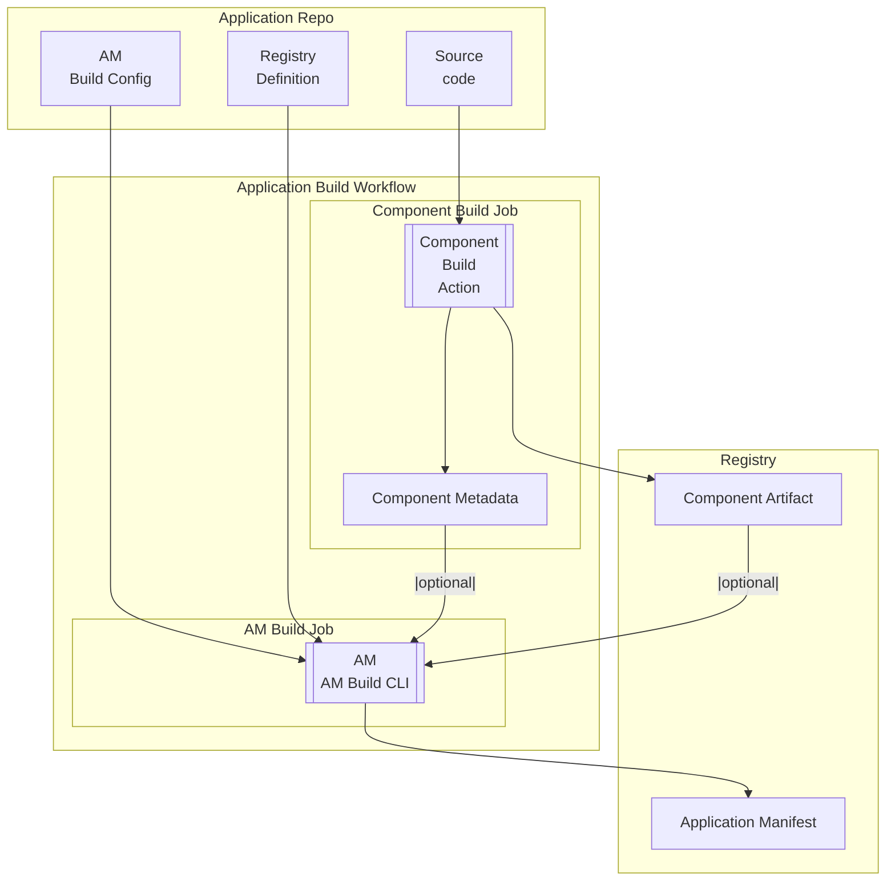

# Application Manifest Build CLI

## Table of Contents

- [Application Manifest Build CLI](#application-manifest-build-cli)
  - [Table of Contents](#table-of-contents)
  - [Proposed Approach](#proposed-approach)
  - [Limitation](#limitation)
  - [Requirements](#requirements)
  - [Application Manifest Examples](#application-manifest-examples)
    - [Simple](#simple)
    - [Jaeger](#jaeger)
    - [QIP](#qip)
  - [Application Manifest Build Config](#application-manifest-build-config)
    - [`artifactMappings` Processing](#artifactmappings-processing)
  - [Component Metadata](#component-metadata)
    - [`application/vnd.docker.image`](#applicationvnddockerimage)
    - [`application/vnd.nc.helm.chart`](#applicationvndnchelmchart)
  - [AM Build CLI execution attributes](#am-build-cli-execution-attributes)
  - [Application Manifest Structure](#application-manifest-structure)
    - [Root-Level Attributes](#root-level-attributes)
    - [Metadata](#metadata)
    - [Components](#components)
      - [\[Components\] `application/vnd.nc.standalone-runnable`](#components-applicationvndncstandalone-runnable)
      - [\[Components\] `application/vnd.docker.image`](#components-applicationvnddockerimage)
      - [\[Components\] `application/vnd.nc.helm.chart`](#components-applicationvndnchelmchart)
        - [\[Components\] `application/vnd.nc.helm.values.schema`](#components-applicationvndnchelmvaluesschema)
        - [\[Components\] `application/vnd.nc.resource-profile-baseline`](#components-applicationvndncresource-profile-baseline)
    - [Dependencies Generation](#dependencies-generation)
  - [Registry Definition](#registry-definition)
  - [Artifact Reference to PURL and Vice Versa](#artifact-reference-to-purl-and-vice-versa)
    - [PURL Format](#purl-format)
    - [Artifact Reference Formats](#artifact-reference-formats)
      - [Docker Images](#docker-images)
      - [Helm Charts](#helm-charts)
      - [GitHub Release](#github-release)
    - [Artifact Reference -\> PURL](#artifact-reference---purl)
    - [PURL -\> Artifact Reference](#purl---artifact-reference)
  - [Use Cases](#use-cases)
  - [Appendix](#appendix)
    - [References](#references)
    - [Potential Application Manifest Cases](#potential-application-manifest-cases)
    - [Potential Application Manifest Components](#potential-application-manifest-components)

## Proposed Approach

It is proposed to develop a CLI for generating the Application Manifest. The CLI will:

- Identify application components from a configuration file
- Collect component attributes from the outputs of the application component build jobs or built artifact
- Generate the Application Manifest and publish it as an artifact
- Uses the Registry Definition to form the PURL of components



## Limitation

1. The component name and component MIME type within the application must be unique
2. For each component's artifact type (Docker, Helm, Maven), application publication goes to one registry per type

## Requirements

1. The CLI must generate AM that validates against [JSON Schema](/schemas/application-manifest.schema.json)
2. The CLI must use as input [Registry Definition v2.0](/schemas/regdef-v2.schema.json)
3. For each application entity listed below, an AM component with the corresponding MIME type must be generated:
    1. "Service" -> `application/vnd.nc.standalone-runnable`
    2. Docker image -> `application/vnd.docker.image`
    3. Helm chart -> `application/vnd.nc.helm.chart`
4. The CLI must complete the AM build for an application with 50 components within 10 seconds
5. The CLI must support execution in both GitLab CI and GitHub Actions environments

## Application Manifest Examples

[Application Manifest JSON schema](/schemas/application-manifest.schema.json)

### Simple


[Simple Application Manifest](/examples/application-manifest.json)

### Jaeger


[Jaeger Application Manifest](/examples/application-manifest-jaeger.json)

### QIP


[QIP Application Manifest](/examples/application-manifest-qip.json)

## Application Manifest Build Config

This config file defines the set of components in the application manifest, their relationships, parameter sources, and additional attributes. It serves as an input for the AM build CLI.

The config is stored in the application repository.

```yaml
# Optional
applicationVersion: <application-version>
# Optional
applicationName: <application-name>
components:
  - # Mandatory
    # Component name
    name: <component-name>
    # Mandatory
    # Component mimeType
    mimeType: enum [ application/vnd.nc.standalone-runnable, application/vnd.docker.image, application/vnd.nc.helm.chart ]
    # Optional
    # If specified, the component's attributes should be collected from an external artifact.
    # Used when the AM is generated for an already built artifact that is NOT built within the same pipeline as the AM.
    # Applicable for application/vnd.docker.image and application/vnd.nc.helm.chart.
    reference: <reference>
    # Optional
    # Used to organize relationships between components
    dependsOn:
      - # Mandatory
        # Component name
        name: <component-name>
        # Mandatory
        # Component mimeType
        mimeType: enum [ application/vnd.docker.image, application/vnd.nc.helm.chart ]
        # Optional
        # See "Artifact mappings for Helm charts" for details
        valuesPathPrefix: <path-or-dot>       
```

**Simple Example:**

```yaml
applicationVersion: 1.2.3
applicationName: application
components:
  # application/vnd.nc.standalone-runnable
  - name: a-standalone-runnable
    mimeType: application/vnd.nc.standalone-runnable
    dependsOn:
      - name: a-helm-chart
        mimeType: application/vnd.nc.helm.chart
  # application/vnd.nc.helm.chart
  - name: a-helm-chart
    mimeType: application/vnd.nc.helm.chart
    dependsOn:
      - name: a-docker-image
        mimeType: application/vnd.docker.image
  # application/vnd.docker.image
  - name: a-docker-image
    mimeType: application/vnd.docker.image
```

**Jaeger Example:**

```yaml
applicationVersion: 1.2.3
applicationName: jaeger
components:
  # application/vnd.nc.standalone-runnable
  - name: cassandra
    mimeType: application/vnd.nc.standalone-runnable
    dependsOn:
      - name: qubership-jaeger
        mimeType: application/vnd.nc.helm.chart
  # application/vnd.nc.helm.chart
  - name: qubership-jaeger
    mimeType: application/vnd.nc.helm.chart
    dependsOn:
      - name: jaeger-cassandra-schema
        mimeType: application/vnd.docker.image
        valuesPathPrefix: cassandraSchema
      - name: jaeger
        mimeType: application/vnd.docker.image
        valuesPathPrefix: jaeger
      - name: jaeger-readiness-probe
        mimeType: application/vnd.docker.image
        valuesPathPrefix: readinessProbe
      - name: example-hotrod
        mimeType: application/vnd.docker.image
        valuesPathPrefix: exampleHotrod
      - name: jaeger-integration-tests
        mimeType: application/vnd.docker.image
        valuesPathPrefix: integrationTests
      - name: jaeger-es-index-cleaner
        mimeType: application/vnd.docker.image
        valuesPathPrefix: elasticsearch.indexCleaner
      - name: jaeger-es-rollover
        mimeType: application/vnd.docker.image
        valuesPathPrefix: elasticsearch.rollover
      - name: envoy
        mimeType: application/vnd.docker.image
        valuesPathPrefix: proxy
      - name: openjdk
        mimeType: application/vnd.docker.image
        valuesPathPrefix: .
      - name: spark-dependencies-image
        mimeType: application/vnd.docker.image
        valuesPathPrefix: spark
      - name: qubership-deployment-status-provisioner
        mimeType: application/vnd.docker.image
        valuesPathPrefix: statusProvisioner
  # application/vnd.docker.image
  - name: jaeger-cassandra-schema
    mimeType: application/vnd.docker.image
    reference: docker.io/jaegertracing/jaeger-cassandra-schema:1.72.0
  - name: jaeger
    mimeType: application/vnd.docker.image
    reference: docker.io/jaegertracing/jaeger:2.9.0
  - name: jaeger-readiness-probe
    mimeType: application/vnd.docker.image
  - name: jaeger-readiness-probe
    mimeType: application/vnd.docker.image
  - name: example-hotrod
    mimeType: application/vnd.docker.image
    reference: docker.io/jaegertracing/example-hotrod:1.72.0
  - name: jaeger-integration-tests
    mimeType: application/vnd.docker.image
  - name: jaeger-es-index-cleaner
    mimeType: application/vnd.docker.image
    reference: docker.io/jaegertracing/jaeger-es-index-cleaner:1.72.0
  - name: jaeger-es-rollover
    mimeType: application/vnd.docker.image
    reference: docker.io/jaegertracing/jaeger-es-rollover:1.72.0
  - name: envoy
    mimeType: application/vnd.docker.image
    reference: docker.io/envoyproxy/envoy:v1.32.6
  - name: openjdk
    mimeType: application/vnd.docker.image
    reference: docker.io/openjdk:11
  - name: spark-dependencies-image
    mimeType: application/vnd.docker.image
  - name: qubership-deployment-status-provisioner
    mimeType: application/vnd.docker.image
```

### `artifactMappings` Processing

For components with `mime-type: application/vnd.nc.helm.chart`, you can define how artifact-derived parameters should be placed into Helm values. The CLI will translate this into the `qubership:helm.values.artifactMappings` property in the Application Manifest.

- Each mapping links a Docker image (or other artifact component) to a `valuesPathPrefix` under which its parameters are injected
- `artifact` should reference another component in this Build Config (by `name`)
- `valuesPathPrefix` is a dot-separated path relative to the chart values root; default is `.`

`valuesPathPrefix` will be used by EnvGene to generate Helm values for the chart in the following format:

```yaml
<valuesPathPrefix>:
  <predefined-artifact-parameter-key>: <predefined-artifact-parameter-value>
```

```yaml
statusProvisioner:
  docker_digest: e305076df2205f1e3968bc566a5ee25f185cbc82ede6d20be8a35a98b8570147
  docker_registry: registry.qubership.org:11000
  docker_repository_name: docker-image-group
  docker_tag: docker-image-version
  image_name: docker-image-name
  name: docker-image-name
  full_image_name: registry.qubership.org:11000/docker-image-group/docker-image-name:docker-image-version
  image: registry.qubership.org:11000/docker-image-group/docker-image-name:docker-image-version
jaeger:
  docker_image_digest: aa5b123cde4567890abcdef1234567890abcdef1234567890abcdef123456789
  registry_url: containers.qubership.org:12000
  repository: sample-image-group
  tag: sample-image-version
  docker_image_name: sample-docker-image
  container_name: sample-docker-image
  full_image_reference: containers.qubership.org:12000/sample-image-group/sample-docker-image:sample-image-version
  container_image: containers.qubership.org:12000/sample-image-group/sample-docker-image:sample-image-version
```

## Component Metadata

Component metadata files are JSON files containing detailed information about individual components (Docker images, Helm charts).

They are generated by component build jobs as output artifacts.

The AM Build CLI reads these files as positional parameters and uses them to enrich component information from the configuration when generating the Application Manifest.

This allows incorporating build-time attributes (hashes, versions, registry references) that are only available after the component is built.

### `application/vnd.docker.image`

```json
{
  "name": "<docker-image-name>",
  "type": "container",
  "mime-type": "application/vnd.docker.image",
  "hashes":[
    {
      "alg": "<hash-algorithm>",
      "content": "<hash-content>"
    }
  ],
  "reference": "registry_host/namespace/image_name:image_tag"
}
```

### `application/vnd.nc.helm.chart`

```json
{
  "name": "<helm-chart-name>",
  "type": "application",
  "mime-type": "application/vnd.nc.helm.chart",
  "reference": "oci://registry_host/namespace/chart_name:chart_version"
}
```

## AM Build CLI execution attributes

| Attribute             | Type   | Mandatory | Description                                                 | Example                                                               |
|-----------------------|--------|-----------|-------------------------------------------------------------|-----------------------------------------------------------------------|
| `--config`/`-c`       | string | yes       | Path to the Application Manifest Build configuration file   | `/path/to/am-build-config.yml`                                        |
| `--version`/`-v`      | string | no        | Application version                                         | `1.2.3`                                                               |
| `--name`/`-n`         | string | mp        | Application name                                            | `my-application`                                                      |
| `--out`/`-o`          | string | yes       | Path where to save the generated Application Manifest       | `/path/to/output/application-manifest.json`                           |
| positional parameters | string | yes       | Paths to component metadata files as positional parameters  | `/path/to/component1-metadata.json /path/to/component2-metadata.json` |

## Application Manifest Structure

**See specification**: [Application Manifest v2 Specification](../analysis/application-manifest-v2-specification.md)

> [!IMPORTANT]
>
> When a required attribute is missing in the AM
>
> Mandatory Attributes:
> If a default exists: The default value is applied  
> If no default exists: Throws readable error
>
> Optional Attributes:
> If a default exists: The default value is applied  
> If no default exists: The attribute remains unset

### Root-Level Attributes

**See specification**: [Root-Level Attributes](../analysis/application-manifest-v2-specification.md#root-level-attributes)

**Generation rules:**

1. `$schema` is always set to `"http://json-schema.org/draft-07/schema#"`
2. `bomFormat` is always set to `"CycloneDX"`
3. `specVersion` is always set to `"1.6"`
4. `serialNumber` is generated as a UUID in the format `urn:uuid:xxxxxxxx-xxxx-xxxx-xxxx-xxxxxxxxxxxx`
5. `version` is always set to `1` (on first generation)
6. `metadata` is generated according to rules (see [Metadata](#metadata))
7. `components` is generated according to rules (see [Components](#components))
8. `dependencies` is generated based on `dependsOn` in the configuration (see [Dependencies Generation](#dependencies-generation))

### Metadata

**See specification**: [Metadata](../analysis/application-manifest-v2-specification.md#metadata-1)

**Generation rules:**

1. `timestamp` is generated as the current date and time in ISO 8601 format (e.g., `2024-01-15T10:30:00Z`)
2. `component` is generated as follows:
   - `component.type` is always `"application"`
   - `component.mime-type` is always `"application/vnd.nc.application"`
   - `component.bom-ref` is generated as `app-{application-name}` or a unique identifier
   - `component.name` is taken from `applicationName` in the configuration or from the `--name` parameter
   - `component.version` is taken from `applicationVersion` in the configuration or from the `--version` parameter
3. `tools` is generated as follows:
   - `tools.components` always contains one element
   - `tools.components[0].type` is always `"application"`
   - `tools.components[0].name` is always `"am-build-cli"`
   - `tools.components[0].version` is taken from the CLI tool version

**Data sources:**

- CLI parameters (`--name`, `--version`)
- Configuration (`applicationName`, `applicationVersion`)
- CLI tool version

### Components

Component structure is described in [Application Manifest v2 Specification](../analysis/application-manifest-v2-specification.md#components). Below are the CLI component generation rules.

#### [Components] `application/vnd.nc.standalone-runnable`

**See specification**: [`application/vnd.nc.standalone-runnable`](../analysis/application-manifest-v2-specification.md#applicationvndncstandalone-runnable)

**Generation rules:**

1. CLI creates one `application/vnd.nc.standalone-runnable` component for each element in the configuration with `mimeType: application/vnd.nc.standalone-runnable`
2. `bom-ref` is generated as `{component-name}` or a unique identifier
3. `name` is taken from the configuration (`name` in the component)
4. `version` is taken from `applicationVersion` in the configuration or from the `--version` parameter
5. `properties` is always an empty array `[]`
6. `components` is always an empty array `[]`

#### [Components] `application/vnd.docker.image`

**See specification**: [`application/vnd.docker.image`](../analysis/application-manifest-v2-specification.md#applicationvnddockerimage)

**Generation rules:**

1. CLI creates an `application/vnd.docker.image` component for each element in the configuration with `mimeType: application/vnd.docker.image`
2. `bom-ref` is generated as `docker-{component-name}` or a unique identifier
3. `name` is taken from the configuration or from Component Metadata (if `reference` is specified)
4. `group` is extracted from `reference` or Component Metadata (namespace/repository group)
5. `version` is extracted from `reference` or Component Metadata (tag)
6. `purl` is generated from `reference` and Registry Definition (see [Artifact Reference to PURL](#artifact-reference-to-purl-and-vice-versa))
7. `hashes` is taken from Component Metadata (if provided)
8. `properties` is always an empty array `[]`
9. `components` is always an empty array `[]`

**Data sources:**

- Component Metadata (if the component is built in the current pipeline)
- `reference` in the configuration (if the component is external)
- Registry Definition (for PURL generation)

#### [Components] `application/vnd.nc.helm.chart`

**See specification**: [`application/vnd.nc.helm.chart`](../analysis/application-manifest-v2-specification.md#applicationvndnchelmchart)

**Generation rules:**

1. CLI creates an `application/vnd.nc.helm.chart` component for each element in the configuration with `mimeType: application/vnd.nc.helm.chart`
2. `bom-ref` is generated as `chart-{component-name}` or a unique identifier
3. `name` is taken from the configuration or from Component Metadata
4. `version` is taken from the configuration or from Component Metadata
5. `purl` is generated from `reference` and Registry Definition (see [Artifact Reference to PURL](#artifact-reference-to-purl-and-vice-versa))
6. `hashes` is taken from Component Metadata (if provided)
7. `properties` is generated as follows:
   - Mandatory property `isLibrary`: `true` for library charts
   - Optional property `qubership:helm.values.artifactMappings`: generated from `dependsOn` in the configuration (see [`artifactMappings` Processing](#artifactmappings-processing))
8. `components` is generated as follows:
   - If `charts/<chart-name>/values.schema.json` exists in the chart artifact, a child component `application/vnd.nc.helm.values.schema` is added (see [Helm Values Schema](#components-applicationvndnchelmvaluesschema))
   - If the folder `charts/<chart-name>/resource-profiles/` exists in the chart artifact with files, a child component `application/vnd.nc.resource-profile-baseline` is added (see [Resource Profile Baseline](#components-applicationvndncresource-profile-baseline))
   - If nested charts are specified in the configuration, they are added as child components `application/vnd.nc.helm.chart`

**Data sources:**

- Component Metadata (if the component is built in the current pipeline)
- `reference` in the configuration (if the component is external)
- Chart artifact (for extracting values.schema.json and resource-profiles)
- Registry Definition (for PURL generation)
- Configuration `dependsOn` (for generating `artifactMappings`)

##### [Components] `application/vnd.nc.helm.values.schema`

**See specification**: [`application/vnd.nc.helm.values.schema`](../analysis/application-manifest-v2-specification.md#applicationvndnchelmvaluesschema)

**Generation rules:**

1. CLI checks for the presence of `values.schema.json` file in the chart artifact at path `charts/<chart-name>/values.schema.json` (at the same level as `Chart.yaml`)
2. If the file exists:
   - A child component `application/vnd.nc.helm.values.schema` is created in the `components` array of the parent Helm chart
   - `bom-ref` is generated as `values-schema-{parent-chart-name}` or a unique identifier
   - `name` is set to `values.schema.json`
   - File contents are read, encoded in base64, and placed in `data[0].contents.attachment.content`
   - `data[0].contents.attachment.contentType` is set to `application/json`
   - `data[0].contents.attachment.encoding` is set to `base64`
3. If the file does not exist, the component is not added (AM generation completes successfully)

**Data sources:**

- Chart artifact: `charts/<chart-name>/values.schema.json`

##### [Components] `application/vnd.nc.resource-profile-baseline`

**See specification**: [`application/vnd.nc.resource-profile-baseline`](../analysis/application-manifest-v2-specification.md#applicationvndncresource-profile-baseline)

**Generation rules:**

1. CLI checks for the presence of the `resource-profiles/` folder in the chart artifact at path `charts/<chart-name>/resource-profiles/` (at the same level as `Chart.yaml`)
2. If the folder exists and contains files:
   - A child component `application/vnd.nc.resource-profile-baseline` is created in the `components` array of the parent Helm chart
   - `bom-ref` is generated as `resource-profile-{parent-chart-name}` or a unique identifier
   - `name` is set to `resource-profile-baselines`
   - For each `*.yaml` or `*.json` file in the `resource-profiles/` folder:
     - An element is created in the `data` array
     - `data[n].type` is set to `configuration`
     - `data[n].name` is set to the filename (e.g., `small.yaml`, `dev.yaml`)
     - File contents are read, encoded in base64, and placed in `data[n].contents.attachment.content`
     - `data[n].contents.attachment.contentType` is determined by file extension: `application/yaml` for `.yaml`, `application/json` for `.json`
     - `data[n].contents.attachment.encoding` is set to `base64`
3. If the folder does not exist or is empty, the component is not added (AM generation completes successfully)

**Data sources:**

- Chart artifact: `charts/<chart-name>/resource-profiles/*.yaml` and `charts/<chart-name>/resource-profiles/*.json`

> [!NOTE]
>
> - `data` may contain multiple profiles (e.g., `small.yaml`, `medium.yaml`, `large.yaml`) or environment profiles (`dev.yaml`, `prod.yaml`)
> - Baseline file structure is not specified; any valid `yaml` or `json` file is considered a valid resource profile

### Dependencies Generation

**See specification**: [Dependencies](../analysis/application-manifest-v2-specification.md#dependencies)

**Generation rules:**

1. CLI generates the `dependencies` array based on `dependsOn` in the component configuration
2. For each component in the configuration that has `dependsOn`:
   - An entry is created in `dependencies` with `ref` equal to the `bom-ref` of this component
   - `dependsOn` is filled with an array of `bom-ref` values of components specified in the `dependsOn` configuration
3. For components without `dependsOn` in the configuration:
   - An entry is created in `dependencies` with an empty array `dependsOn: []`
4. `bom-ref` values for dependencies must match `bom-ref` values of components in the `components` array

**Example:**

If the configuration specifies:

```yaml
components:
  - name: a-standalone-runnable
    mimeType: application/vnd.nc.standalone-runnable
    dependsOn:
      - name: a-helm-chart
        mimeType: application/vnd.nc.helm.chart
  - name: a-helm-chart
    mimeType: application/vnd.nc.helm.chart
    dependsOn:
      - name: a-docker-image
        mimeType: application/vnd.docker.image
```

Then the AM is generated as:

```json
{
  "dependencies": [
    {
      "ref": "a-standalone-runnable",
      "dependsOn": ["chart-a-helm-chart"]
    },
    {
      "ref": "chart-a-helm-chart",
      "dependsOn": ["docker-a-docker-image"]
    },
    {
      "ref": "docker-a-docker-image",
      "dependsOn": []
    }
  ]
}
```

## Registry Definition

Registry configuration where in particular in the sections:

- `dockerConfig` describes the registry configuration where Docker artifacts are stored
- `helmAppConfig` describes the registry configuration where Helm artifacts are stored

Each individual registry is described by a separate `yaml` file in the `/configurations/RegDefs/` folder in the source code repository.

The `name` attribute must match the filename without the extension.

[Registry Definition v2.0](/schemas/regdef-v2.schema.json)

[Example](/examples/sandbox.yml)

[Qubership Example](/examples/qubership.yml)

## Artifact Reference to PURL and Vice Versa

The CLI needs to convert between artifact references (standard URLs) and Package URLs (PURLs) for different purposes:

- **Artifact Reference → PURL**: When generating the Application Manifest, the CLI converts artifact references (e.g., `docker.io/namespace/image:tag`) to PURLs (e.g., `pkg:docker/namespace/image@tag?registry_name=docker-hub`) to store them in the manifest. This conversion uses Registry Definition to determine the `registry_name` qualifier.

- **PURL → Artifact Reference**: When processing external artifacts specified by PURL in the configuration file, or when downloading artifacts (e.g., Helm charts), the CLI converts PURLs back to artifact references to interact with registries and tools that require standard URLs.

The conversion process relies on Registry Definitions to map between registry identifiers (`registry_name` in PURL) and actual registry URLs and parameters.

### PURL Format

```text
pkg:[TYPE]/[NAMESPACE]/[NAME]@[VERSION]?[QUALIFIERS]
```

`pkg:` - prefix indicating this is a Package URL  
`TYPE` - artifact type (`docker`, `helm`, `github`)  
`NAMESPACE` - group or organization  
`NAME` - artifact name  
`@VERSION` - version  
`?QUALIFIERS` - additional qualifiers  

> [!NOTE]
> We use for qualifiers:
>
> 1. `registry_name` - registry reference for each `TYPE`
> 2. `file_name` - filename, only for `TYPE: github`

### Artifact Reference Formats

#### Docker Images

For Docker images (Docker Registry or OCI-compatible registry):

```text
REGISTRY_HOST[:PORT]/NAMESPACE/IMAGE:TAG
```

| Field            | Type   | Mandatory | Default    | Description                   |
|------------------|--------|-----------|------------|-------------------------------|
| `REGISTRY_HOST`  | string | yes       | `docker.io`| Docker registry host          |
| `PORT`           | number | no        | 443        | Docker registry port          |
| `NAMESPACE`      | string | yes       | None       | Group or organization         |
| `IMAGE`          | string | yes       | None       | Docker image name             |
| `TAG`            | string | yes       | latest     | Image version                 |

#### Helm Charts

For Helm charts (OCI registry):

```text
oci://REGISTRY_HOST[:PORT]/NAMESPACE/IMAGE:TAG
```

| Field             | Type   | Mandatory | Default | Description                     |
|-------------------|--------|-----------|---------|---------------------------------|
| `oci://`          | string | yes       | None    | prefix for OCI registry         |
| `REGISTRY_HOST`   | string | yes       | None    | OCI registry host               |
| `PORT`            | number | no        | 443     | OCI registry port               |
| `NAMESPACE`       | string | yes       | None    | group or organization           |
| `IMAGE`           | string | yes       | None    | Helm chart name                 |
| `TAG`             | string | yes       | None    | chart version                   |

For Helm charts (File registry):

```text
https://REGISTRY_HOST[:PORT]/PATH/IMAGE-VERSION.tgz
```

| Field             | Type   | Mandatory | Default | Description                     |
|-------------------|--------|-----------|---------|---------------------------------|
| `https://`        | string | yes       | None    | prefix for HTTP/HTTPS registry  |
| `REGISTRY_HOST`   | string | yes       | None    | File registry host              |
| `PORT`            | number | no        | 443     | File registry port              |
| `PATH`            | string | no        | None    | Path to chart repository        |
| `IMAGE`           | string | yes       | None    | Helm chart name                 |
| `VERSION`         | string | yes       | None    | chart version                   |

#### GitHub Release

For Helm charts:

```text
REGISTRY_HOST[:PORT]/OWNER/REPO/releases/download/TAG/ARTIFACT-FILE
```

| Field           | Type   | Mandatory | Default | Description       |
|-----------------|--------|-----------|---------|-------------------|
| `OWNER`         | string | yes       | None    | Repository owner  |
| `REPO`          | string | yes       | None    | Repository name   |
| `TAG`           | string | yes       | None    | Release tag       |
| `ARTIFACT-FILE` | string | yes       | None    | Artifact filename |

### Artifact Reference -> PURL

1. **Determining `TYPE` for PURL**

    If Artifact Reference contains `https://github.com/` - `github`  
    Then by `mime-type` from [AM Build Config or Component Metadata](#proposed-approach) - `docker`, `helm`

2. **Parsing Artifact Reference**

    For `docker`: Extract `REGISTRY_HOST[:PORT]`, `NAMESPACE`, `IMAGE`, `TAG`  
    For `helm` with `oci://` prefix: Extract `REGISTRY_HOST[:PORT]`, `NAMESPACE`, `IMAGE`, `TAG`  
    For `helm` with `https://` or `http://` prefix: Extract `REGISTRY_HOST[:PORT]`, `PATH`, `IMAGE`, `VERSION` from URL (parse `IMAGE-VERSION.tgz` format)  
    For `github`: Extract `REGISTRY_HOST[:PORT]`, `OWNER`, `REPO`, `TAG`, `ARTIFACT-FILE`

3. **Finding `registry_name` (one of `?QUALIFIERS`)**

    Find Registry Definition where the values

    For `docker`

   - `dockerConfig.groupUri`/`dockerConfig.groupName`

    For `github`

   - `githubReleaseConfig.repositoryDomainName`/`githubReleaseConfig.owner`/`githubReleaseConfig.repository`

    For `helm`

   - `helmAppConfig.repositoryDomainName`/`helmAppConfig.helmGroupRepoName`

    Match with `REGISTRY_HOST[:PORT]` from Artifact Reference (for `helm` - both OCI and File registry) or `REGISTRY_HOST[:PORT]/NAMESPACE` (for `docker`) or `https://github.com/OWNER/REPO` (for `github`)

    The value of the `name` attribute of such registry will be the target value for `?QUALIFIERS` (`registry_name`)

4. **Build PURL**

    | PURL Parameter | Value Source                                                                                       |
    |----------------|----------------------------------------------------------------------------------------------------|
    | `TYPE`         | from Step 1                                                                                        |
    | `NAMESPACE`    | from Step 2. `NAMESPACE` (for `docker`, `helm`) or `OWNER` (for `github`)                          |
    | `NAME`         | from Step 2. `IMAGE` (for `docker`, `helm`) or `REPO` (for `github`)                               |
    | `@VERSION`     | from Step 2. `TAG`                                                                                 |
    | `?QUALIFIERS`  | from Step 3. `registry_name=<>` and from Step 2 `file_name=<>` `ARTIFACT-FILE` (only for `github`) |

**Examples:**

- `<qubership-host>/core/qubership-core:2.1.0` -> `pkg:docker/core/qubership-core@2.1.0?registry_name=qubership`
- `https://github.com/Netcracker/qubership-airflow/releases/download/2.0.1/airflow-1.19.0-dev.tgz` -> `pkg:github/Netcracker/qubership-airflow@2.0.1?registry_name=qubership&file_name=airflow-1.19.0-dev.tgz`
- `oci://<qubership-host>/app-team/service-api:v3.2.1` -> `pkg:helm/app-team/service-api@v3.2.1?registry_name=qubership`
- `https://artifactory.qubership.com/nc.helm.charts/scheduling-service-0.0.1-master-20260903.195778-11.tgz` -> `pkg:helm/scheduling-service@0.0.1-master-20260903.195778-11?registry_name=qubership`

### PURL -> Artifact Reference

1. **Parse PURL**

    Extract `TYPE`, `NAMESPACE`, `NAME`, `@VERSION`, `?QUALIFIERS`, `#SUBPATH`

2. **Determine `REGISTRY_HOST[:PORT]`**

    Based on `TYPE` and `?QUALIFIERS` `registry_name` determine:

    For `docker`

   - `dockerConfig.groupUri`/`dockerConfig.groupName`

    For `github`

   - `githubReleaseConfig.repositoryDomainName`/`githubReleaseConfig.owner`/`githubReleaseConfig.repository`

    For `helm`

   - `helmAppConfig.repositoryDomainName`/`helmAppConfig.helmGroupRepoName`

3. **Build Artifact Reference**

    | Artifact Reference Parameter | Value Source                                         |
    |------------------------------|------------------------------------------------------|
    | `oci://`                     | for (`helm` OCI registry)                            |
    | `https://`                   | for (`helm` File registry)                           |
    | `REGISTRY_HOST[:PORT]`       | From Step 2                                          |
    | `NAMESPACE`                  | `NAMESPACE` from PURL (for `docker` and `helm`)      |
    | `IMAGE`                      | `NAME` from PURL (for `docker` and `helm`)           |
    | `TAG`                        | `@VERSION` from PURL (for `docker` and `helm` OCI)   |
    | `VERSION`                    | `@VERSION` from PURL (for `helm` File registry)      |
    | `OWNER`                      | `NAMESPACE` from PURL (for `github`)                 |
    | `REPO`                       | `NAME` from PURL (for `github`)                      |
    | `TAG`                        | `@VERSION` from PURL (for `github`)                  |
    | `ARTIFACT-FILE`              | `?QUALIFIERS` `&file_name=` from PURL (for `github`) |

    For `helm` File registry: Build as `https://REGISTRY_HOST[:PORT]/PATH/IMAGE-VERSION.tgz` where PATH is determined from Registry Definition or empty

**Examples:**

- `pkg:docker/envoyproxy/envoy:v1.32.6?registry_name=qubership`-> `<qubership-host>/envoyproxy/envoy:v1.32.6`
- `pkg:github/Netcracker/qubership-airflow@2.0.1?registry_name=qubership&file_name=airflow-1.19.0-dev.tgz`-> `https://github.com/Netcracker/qubership-airflow/releases/download/2.0.1/airflow-1.19.0-dev.tgz`
- `pkg:helm/netcracker/qubership-core@2.1.0?registry_name=qubership`-> `oci://<qubership-host>/netcracker/qubership-core:2.1.0`
- `pkg:helm/scheduling-service@0.0.1-master-20260903.197758-11?registry_name=qubership`-> `https://artifactory.qubership.com/nc.helm.charts/scheduling-service-0.0.1-master-20260903.195778-11.tgz`

## Use Cases

1. Building a multi-component application with:
   1. `application/vnd.nc.standalone-runnable`
   2. Docker images
      1. By source:
         1. Local (built as part of current build process)
         2. External (built as part of another build process)
         3. Mixed (combination of local and external images)
   3. Helm charts
      1. By source:
         1. Local (built as part of current build process)
         2. External (built as part of another build process)
         3. Mixed (combination of local and external charts)
      2. By structure:
         1. One umbrella chart per application
         2. One non-umbrella chart per application
         3. Multiple non-umbrella charts per application
2. Publishing the Application Manifest
   1. To OCI registry
   2. As build artifact

## Appendix

### References

1. [Application Manifest Build CLI](https://github.com/borislavr/qubership-app-manifest-cli)
2. [Application repository with configured Application Manifest build](https://github.com/borislavr/qubership-jaeger)

### Potential Application Manifest Cases


### Potential Application Manifest Components


