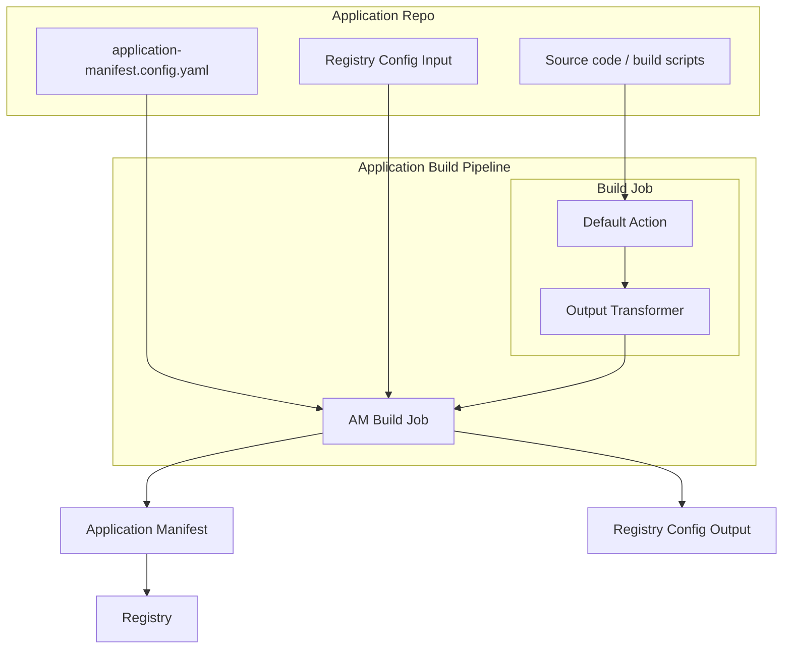

# Application Manifest Build CLI

## Table of Contents

- [Application Manifest Build CLI](#application-manifest-build-cli)
  - [Table of Contents](#table-of-contents)
  - [Proposed Approach](#proposed-approach)
  - [Use Cases](#use-cases)
  - [Open Question](#open-question)
  - [Limitation](#limitation)
  - [Requirements](#requirements)
  - [Application Manifest Structure](#application-manifest-structure)
    - [Metadata](#metadata)
    - [Components](#components)
      - [`application/vnd.qubership.service`](#applicationvndqubershipservice)
      - [`application/vnd.docker.image`](#applicationvnddockerimage)
      - [`application/vnd.qubership.helm.chart`](#applicationvndqubershiphelmchart)
  - [Application Manifest Build Config](#application-manifest-build-config)

## Proposed Approach

It is proposed to develop a CLI for generating the Application Manifest. The CLI will:

- Identify application components from a configuration file or by automatic discovery
- Collect component attributes from the outputs of the application component build jobs
- Generate the Application Manifest and registry configuration file and publish it as an artifact



> **Note:**
> The Output Transformer transforms the output of the default build action to the standard schema expected by the CLI. This approach decouples the CLI from changes in job outputs, solving the problem described in Open Question 7.
>
> For example:
>
> ```yaml
> type: application
> mime-type: application/vnd.qubership.helm.chart
> name: my-chart
> version: 1.2.3
> purl: pkg:helm/example-repo/my-chart@1.2.3?registryName=sandbox
> hashes:
>   - alg: SHA-256
>     content: 0af86284290a31b9b4d6d0fa6710584a8f6016a0155c8dc9951a317c81938d91
> properties:
>   - name: isUmbrella
>     value: true
> ```

## Use Cases

1. Building a multi-service application with:
   1. Docker images
      1. External (built as part of another build process)
   2. Helm charts
      1. One umbrella chart per application
      2. One non-umbrella chart per application
      3. Multiple non-umbrella charts
      4. External (built as part of another build process) non-umbrella charts
   3. Publishing the Application Manifest

## Open Question

1. How does Build CLI determine the list of components to include in the Application Manifest (AM)?
   1. Configuration file as input
   2. Automatic discovery from the build workflow
   3. Automatic discovery from the application repository
2. In what format should the CLI receive component attributes from the outputs of component build jobs? Should there be a standard schema for these outputs?
3. How should the CLI identify which build job output to use for generating each specific component in the manifest?
   1. Is there a mapping mechanism or naming convention that should be followed?
   2. How should conflicts or ambiguities be resolved if multiple jobs produce similar outputs?
4. How should the CLI handle cases where the application includes a component that is a dependency, such as a Helm library?
5. Is the registry configuration an input contract, an output contract, or both?
    **A:** The registry configuration is primarily an input contract: it tells the CLI where to publish artifacts and how to authenticate. However, the CLI generate or update registry-related output files for downstream use.
6. Which Docker image tag should be used for the Docker image component?
7. How to ensure that changes to the job/action that builds components (since job outputs read by CLI are different and not contracted) don't require rewriting the build CLI?
   1. By using a standard output schema for all build jobs and using the config file to map outputs to manifest components, the CLI can remain decoupled from specific job implementations. Any changes in job outputs should be reflected in the config file or in the output schema, not in the CLI code itself?

## Limitation

1. All application components described in AM must be built in the same repository, within the same workflow as AM build
2. For each component's artifact type (Docker, Helm, Maven), application publication goes to one registry per type

## Requirements

1. The CLI must generate AM that validates against [JSON Schema](/schemas/application-manifest.schema.json)
2. The CLI must generate registry config that validates against JSON Schema **TBD**
3. AM must be published as a Maven (or OCI) artifact
   1. Artifact ID must match the application name
   2. Registry parameters for publishing (URL, credentials, group) must be provided as CLI arguments.
4. For each application entity listed below, an AM component with the corresponding MIME type must be generated:
    1. Service -> `application/vnd.qubership.service`
    2. Docker image -> `application/vnd.docker.image`
    3. Helm chart -> `application/vnd.qubership.helm.chart`
    <!-- 4. ZIP archive -> `application/zip` -->
5. The CLI must complete the AM build for an application with 50 components within 10 seconds
6. The CLI must support execution in both GitLab CI and GitHub Actions environments

## Application Manifest Structure

> [!IMPORTANT]
>
> When a required attribute is missing in the AM
>
> Mandatory Attributes:
> If a default exists: The default value is applied  
> If no default exists: Throws readable error
>
> Optional Attributes:
> If a default exists: The default value is applied  
> If no default exists: The attribute remains unset

### Metadata

Describes BOM metadata.

| Attribute                     | Type   | Mandatory | Default                                 | Description                                       | Source  |
|-------------------------------|--------|-----------|-----------------------------------------|---------------------------------------------------|---------|
| `timestamp`                   | string | yes       | None                                    | Specifies the date and time of the AM creation    | N/A     |
| `component`                   | object | yes       | None                                    | Describes the application itself                  | N/A     |
| `component.type`              | string | yes       | `application`                           | Type of the component                             | N/A     |
| `component.mime-type`         | string | yes       | `application/vnd.qubership.application` | Mime-type of the component                        | N/A     |
| `component.bom-ref`           | string | yes       | None                                    | Unique component identifier within the AM         | `${component-name}:${generated-uuid-v4}` |
| `component.name`              | string | yes       | None                                    | Name of the application                           | **TBD** |
| `component.version`           | string | yes       | None                                    | Version of the application                        | **TBD** |
| `tools`                       | object | yes       | None                                    | The tool(s) used to create the AM                 | N/A     |
| `tools.components`            | array  | yes       | `[]`                                    | A list of components used as tools                | N/A     |
| `tools.components[n].type`    | string | yes       | `application`                           | Type of the tool component                        | N/A     |
| `tools.components[n].name`    | string | yes       | `am-build-cli`                          | Name of the tool component (e.g., `am-build-cli`) | N/A     |
| `tools.components[n].version` | string | yes       | None                                    | Version of the tool component                     | N/A     |

### Components

#### `application/vnd.qubership.service`

An abstract component necessary to link artifacts of different types together

| Attribute                                   | Type   | Mandatory | Default                            | Description                                                                 | Source  |
|---------------------------------------------|--------|-----------|------------------------------------|-----------------------------------------------------------------------------|---------|
| `bom-ref`                                   | string | yes       | None                               | Unique component identifier within the AM                                   | `${component-name}:${generated-uuid-v4}` |
| `type`                                      | string | yes       | `application`                      | Component type                                                              | N/A     |
| `mime-type`                                 | string | yes       | `application/vnd.qubership.service`| Component MIME type                                                         | N/A     |
| `name`                                      | string | yes       | None                               | Service name                                                                | **TBD** |
| `version`                                   | string | yes       | None                               | Service version                                                             | **TBD** |
| `components`                                | array  | no        | None                               | List of nested components                                                   | N/A     |
| `components[0]`                             | object | no        | None                               | Describes resource profile baselines for the service.                       | N/A     |
| `components[0].bom-ref`                     | string | yes       | None                               | Unique component identifier within the AM for the resource profile baseline | `${component-name}:${generated-uuid-v4}` |
| `components[0].type`                        | string | yes       | `configuration`                    | Component type                                                              | N/A     |
| `components[0].mime-type`                   | string | yes       | `application/vnd.qubership.resource-profile-baseline` | MIME type for the resource profile baseline              | N/A     |
| `components[0].name`                        | string | yes       | `resource-profile-baselines`        | Name of the resource profile baseline component                            | N/A     |
| `components[0].data`                        | array  | yes       | None                               | Array of resource profile baseline configurations                           | For each file in `/${service-name}/charts/${service-name}/resource-profiles/`, an element is generated. If the file is JSON, it is transformed to YAML |
| `components[0].data[n].type`                | string | yes       | `configuration`                    | Configuration type                                                          | N/A     |
| `components[0].data[n].name`                | string | yes       | None                               | Name of the configuration file, e.g., `dev.yaml`                            | N/A     |
| `components[0].data[n].contents`            | object | yes       | None                               | Contains the configuration data                                             | N/A     |
| `components[0].data[n].contents.attachment` | object | yes       | None                               | Attachment object containing the file data                                  | N/A     |
| `components[0].data[n].contents.attachment.contentType` | string | yes | `application/yaml` | Attachment object MIME type                                                           | N/A     |
| `components[0].data[n].contents.attachment.encoding` | string | yes | `base64` | Encoding                                                                                           | N/A     |
| `components[0].data[n].contents.attachment.content` | string | yes | None | Base64-encoded file contents. The file content is encoded using `base64`                                | The file content is encoded using `base64`  |

#### `application/vnd.docker.image`

Describes Docker image as an artifact

| Attribute       | Type   | Mandatory | Default                        | Description                                                          | Source  |
|-----------------|--------|-----------|--------------------------------|----------------------------------------------------------------------|---------|
| `bom-ref`       | string | yes       | None                           | Unique component identifier within the AM                             | `${component-name}:${generated-uuid-v4}` |
| `type`          | string | yes       | `container`                    | Component type                                                       | N/A |
| `mime-type`     | string | yes       | `application/vnd.docker.image` | Component MIME type                                                  | N/A |
| `name`          | string | yes       | None                           | Docker image name                                                    | **TBD** |
| `group`         | string | yes       | `""`                           | Group or namespace for the image (empty string if none)              | **TBD** |
| `version`       | string | yes       | None                           | Docker image version (tag)                                           | **TBD** |
| `purl`          | string | yes       | None                           | Package URL (PURL) for the image                                     | **TBD** |
| `hashes`        | array  | yes       | `[]`                           | List of hashes for the image (empty array if none)                   | **TBD** |
| `hashes.alg`    | string | yes       | None                           | Hash algorithm, e.g., "SHA-256" (required if hash present)           | **TBD** |
| `hashes.content`| string | yes       | None                           | Hash value as a hex string (required if hash present)                | **TBD** |

#### `application/vnd.qubership.helm.chart`

Root components of this type describe artifacts, nested helm charts describe abstract helm charts (this is necessary to properly form values.yaml)

| Attribute                  | Type    | Mandatory | Default                              | Description                                                                 | Source  |
|----------------------------|---------|-----------|--------------------------------------|-----------------------------------------------------------------------------|---------|
| `bom-ref`                  | string  | yes       | None                                 | Unique component identifier within the AM                                    | `${component-name}:${generated-uuid-v4}` |
| `type`                     | string  | yes       | `application`                        | Component type                                                              | N/A |
| `mime-type`                | string  | yes       | `application/vnd.qubership.helm.chart`| Component MIME type                                                         | N/A |
| `name`                     | string  | yes       | None                                 | Helm chart name                                                             | **TBD** |
| `version`                  | string  | yes       | None                                 | Helm chart version                                                          | **TBD** |
| `purl`                     | string  | yes       | `""`                                 | Package URL (PURL) for the chart. Not set for nested charts under umbrella chart | **TBD** |
| `hashes`                   | array   | no        | None                                 | List of hashes for the chart (empty array if none). Not set for nested charts under umbrella chart | **TBD** |
| `hashes.alg`               | string  | yes       | None                                 | Hash algorithm, e.g., "SHA-256" (required if hash present)                   | **TBD** |
| `hashes.content`           | string  | yes       | None                                 | Hash value as a hex string (required if hash present)                       | **TBD** |
| `properties`               | array   | yes       | None                                 | List of additional properties                                               | **TBD** |
| `properties[n].name`       | string  | yes       | `isUmbrella`                         | Always set to "isUmbrella" for this property entry.                         | **TBD** |
| `properties[n].value`      | boolean | yes       | None                                 | Indicates if the chart is an umbrella chart.                                 | **TBD** |
| `properties[n].name`       | string  | yes       | `isLibrary`                          | Always set to "isLibrary" for this property entry.                          | **TBD** |
| `properties[n].value`      | boolean | yes       | None                                 | Indicates if the chart is a library chart.                                  | **TBD** |
| `properties[n].name`       | string  | yes       | `alias`                              | Always set to "alias" for this property entry.                              | **TBD** |
| `properties[n].value`      | string  | yes       | `""`                                 | Alias for the Helm chart.                                                   | **TBD** |
| `components`               | array   | no        | None                                 | List of nested Helm charts. A nested chart is not an artifact and has no `purl` or `hashes`. | **TBD** |
| `components[n].bom-ref`    | string  | yes       | None                                 | Unique identifier for the nested chart.                                     | **TBD** |
| `components[n].type`       | string  | yes       | `application`                        | Component type for the nested chart.                                        | N/A     |
| `components[n].mime-type`  | string  | yes       | `application/vnd.qubership.helm.chart`| MIME type for the nested chart.                                            | N/A     |
| `components[n].name`       | string  | yes       | None                                 | Name of the nested chart.                                                   | **TBD** |
| `components[n].version`    | string  | yes       | None                                 | Version of the nested chart.                                                  | **TBD** |
| `components[n].properties` | array   | yes       | `[]`                                 | Additional properties for the nested chart.                                 | **TBD** |
| `properties[n].name`       | string  | yes       | `isLibrary`                          | Always set to "isLibrary" for this property entry.                          | **TBD** |
| `properties[n].value`      | boolean | yes       | None                                 | Indicates if the nested chart is a library chart.                           | **TBD** |
| `properties[n].name`       | string  | yes       | `alias`                              | Always set to "alias" for this property entry.                              | **TBD** |
| `properties[n].value`      | string  | yes       | `""`                                 | Alias for the nested chart.                                                 | **TBD** |

> [!NOTE]
> The `components` array is recursive
> A nested chart within this array can have its own `components` array to represent
> its own dependencies

<!-- #### `application/zip`

Describes ZIP archive as a Maven artifact

| Attribute       | Type   | Mandatory | Default | Description                                                          | Source  |
|-----------------|--------|-----------|---------|----------------------------------------------------------------------|---------|
| `bom-ref`       | string | yes       | None    | Unique component identifier within the AM                             | `${component-name}:${generated-uuid-v4}` |
| `type`          | string | yes       | `data`  | Component type                                                       | N/A |
| `mime-type`     | string | yes       | `application/zip` | Component MIME type                                            | N/A |
| `name`          | string | yes       | None    | ZIP archive name                                                     | **TBD** |
| `group`         | string | yes       | `""`    | Group or namespace for the archive (empty string if none)              | **TBD** |
| `version`       | string | yes       | None    | ZIP archive version                                                  | **TBD** |
| `purl`          | string | yes       | None    | Package URL (PURL) for the archive                                   | **TBD** |
| `hashes`        | array  | yes       | `[]`    | List of hashes for the archive (empty array if none)                 | **TBD** |
| `hashes.alg`    | string | yes       | None    | Hash algorithm, e.g., "SHA-256" (required if hash present)           | **TBD** |
| `hashes.content`| string | yes       | None    | Hash value as a hex string (required if hash present)                | **TBD** | -->

## Application Manifest Build Config

This file defines which services and components make up application and how each component is linked to its build job and artifact in your CI/CD pipeline. It is the single source of truth for the CLI to generate the Application Manifest (AM):

- Lists all services and their components to be included in the AM
- Maps each component to the CI/CD job and artifact that produces it

The config should be stored in application repository

```yaml
services:
  <service-name>:
    includes:
      # Type of the service component
      - type: enum[docker, helm]
        # Name of the CI/CD job that builds this component
        job: string
        # Name of the artifact produced by the job      
        artifact: string
```

**Example:**

```yaml
services:
  ui:
    includes:
      - type: docker
        job: build-ui-image
        artifact-name: ui-image
      - type: helm
        job: build-ui-chart
        artifact: ui-chart
  variables-management:
    includes:
      - type: docker
        job: build-variables-docker
        artifact: variables-management-image
      - type: helm
        job: build-variables-helm
        artifact: variables-management-chart
  systems-catalog:
    includes:
      - type: docker
        job: build-systems-docker
        artifact: systems-catalog-image
      - type: helm
        job: build-systems-helm
        artifact: systems-catalog-chart
  platform-catalog:
    includes:
      - type: docker
        job: build-platform-docker
        artifact: platform-catalog-image
      - type: helm
        job: build-platform-helm
        artifact: platform-catalog-chart
  engine:
    includes:
      - type: docker
        job: build-engine-docker
        artifact: engine-image
      - type: helm
        job: build-engine-helm
        artifact: engine-chart
  sessions-management:
    includes:
      - type: docker
        job: build-sessions-docker
        artifact: sessions-management-image
      - type: helm
        job: build-sessions-helm
        artifact: sessions-management-chart
  cr-synchronizer:
    includes:
      - type: docker
        job: build-cr-docker
        artifact: cr-synchronizer-image
      - type: helm
        job: build-cr-helm
        artifact: cr-synchronizer-chart
  backend:
    includes:
      - type: docker
        job: build-backend-docker
        artifact: backend-image
      - type: helm
        job: build-backend-helm
        artifact: backend-chart
```

<!-- ## Registry Config

```yaml
sandbox:
  auth:
    method: <none|basic|token|apiKey|...>
    username:
    password:
    token: 
    apiKey:
  docker:
    auth:
      ...
    snapshotRepository: ""
    stagingRepository: ""
    releaseRepository: ""
  maven:
    auth:
      ...
    snapshotRepository: ""
    stagingRepository: ""
    releaseRepository: ""
  helm:
    auth:
      ...
    snapshotRepository: ""
    stagingRepository: ""
    releaseRepository: ""
``` -->
