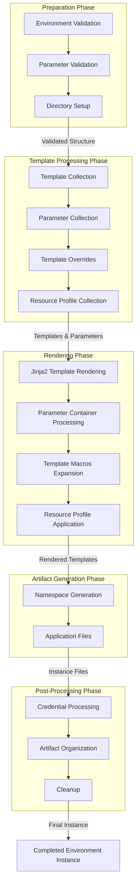

# Environment Instance Generation

## Table of Contents

- [Environment Instance Generation](#environment-instance-generation)
  - [Table of Contents](#table-of-contents)
  - [Problem Statements](#problem-statements)
    - [Goals](#goals)
  - [Proposed Approach](#proposed-approach)
    - [Instance Repository Pipeline Parameters](#instance-repository-pipeline-parameters)
    - [Instance Generation Process](#instance-generation-process)
    - [Generated Environment Instance Examples](#generated-environment-instance-examples)
      - [Environment Instance Structure](#environment-instance-structure)

## Problem Statements

While Environment Inventory generation creates the necessary configuration files and parameters for an environment, it does not actually build the environment instance artifacts. Environment Instance generation is needed to transform the inventory into a complete, deployable environment instance.

### Goals

Develop a process in EnvGene that enables the transformation of Environment Inventories into fully realized Environment Instances that can be deployed to target clusters.

## Proposed Approach

The Environment Instance generation process builds upon the Environment Inventory by applying templates, resolving variables, and generating the final instance artifact. This is a separate step that occurs after inventory generation and is controlled by the `ENV_BUILDER` parameter.

The external system will initiate Environment Instance generation by triggering the instance pipeline with `ENV_BUILDER=true`, along with other required parameters. The target Environment for Instance generation is determined by the `ENV_NAMES` attribute, which follows the `<cluster-name>/<env-name>` notation.

### Instance Repository Pipeline Parameters

| Parameter | Type | Mandatory | Description | Example |
|-----------|-------------|------|---------|----------|
| `ENV_BUILDER` | string | no | If `true`, the Environment Instance generation job is executed. | `true` OR `false` |
| `ENV_NAMES` | string | yes | Specifies the environment(s) for which processing will be triggered. Uses the `<cluster-name>/<env-name>` notation. | `ocp-01/platform` |
| `ENV_TEMPLATE_VERSION` | string | no | If provided, system updates Environment Template version in the Environment Inventory. | `env-template:v1.2.3` |

Additional parameters from the [Instance Pipeline Parameters](instance-pipeline-parameters.md) documentation may also be used to control various aspects of the instance generation process.

### Instance Generation Process

#### Process Flow Diagram



The Environment Instance generation process includes the following detailed steps:

1. **Preparation Phase**
   - **Environment Validation**: Validates that the environment directory structure and configuration files are correct
   - **Parameter Validation**: Validates all parameter files against the parameter schema
   - **Directory Setup**: Creates necessary temporary directories for rendering templates and storing intermediate files
   
   **Output**: Validated environment structure and temporary working directories for the generation process

2. **Template Processing Phase**
   - **Template Collection**: Gathers templates from the template repository based on the environment template name
   - **Parameter Collection**: Collects parameters from template, cluster, and environment-specific locations
   - **Template Overrides**: Processes any template override files that customize the base templates
   - **Resource Profile Collection**: Gathers resource profiles from templates and environment-specific locations
   
   **Output**: Consolidated set of templates, parameters, overrides, and resource profiles ready for rendering

3. **Rendering Phase**
   - **Jinja2 Template Rendering**: Processes all templates using Jinja2 with environment-specific variables
   - **Parameter Container Processing**: Applies parameter containers to namespaces according to template definitions
   - **Template Macros Expansion**: Expands any macros defined in templates with their actual values
   - **Environment-Specific Resource Profile Application**: Applies environment-specific resource profiles to override defaults
   
   **Output**: Rendered template files with all variables resolved and macros expanded

4. **Artifact Generation Phase**
   - **Namespace Generation**: Creates namespace configuration files based on templates
   - **Application Files**: Generates application files based on templates and parameters
   
   **Output**: Instance artifact files organized by namespace and application

5. **Post-Processing Phase**
   - **Credential Processing**: Processes and encrypts credential files
   - **Artifact Organization**: Organizes all generated files into the proper directory structure
   - **Cleanup**: Removes temporary files and directories
   
   **Output**: Final environment instance with properly organized and secured instance artifacts

The process is executed in the `env_builder` job within the instance repository pipeline. This job must be executed after the inventory generation job if both are being run in the same pipeline.

### Generated Environment Instance Examples

#### Environment Instance Structure

After successful instance generation, the environment directory will contain the following structure:

```
/environments/<cluster-name>/<env-name>/
├── Credentials/
│   ├── credentials.yml (encrypted)
│   └── inventory_generation_creds.yml (encrypted)
├── Inventory/
│   ├── env_definition.yml
│   ├── parameters/
│   │   ├── paramsetA.yml
│   │   └── paramsetB.yml
│   └── solution-descriptor/
│       └── sd.yaml
├── Namespaces/
│   ├── namespace1/
│   │   ├── namespace.yml
│   │   └── applications/
│   │       └── app1.yml
│   └── namespace2/
│       ├── namespace.yml
│       └── applications/
│           └── app2.yml
├── Profiles/
|   └── resource profiles
├── cloud.yml
└── tenant.yml
```

The key differences between Inventory and Instance are:

1. **Inventory** contains only configuration parameters, credentials, and solution descriptors
2. **Instance** contains the fully rendered templates, namespace configurations, application files, and resource profiles

The Instance generation process transforms the declarative configuration in the Inventory into concrete artifacts that can be applied to the target environment. This includes expanding templates, resolving variables, and generating all necessary files.
