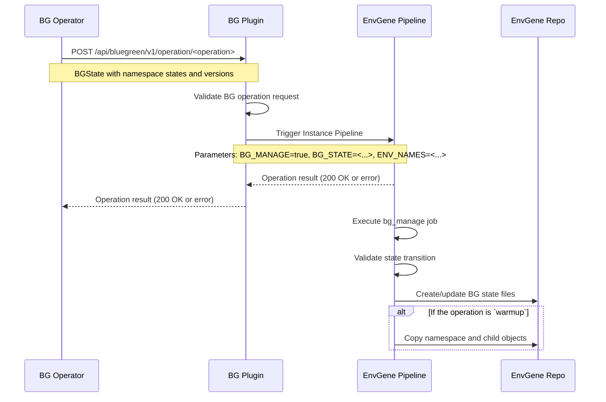
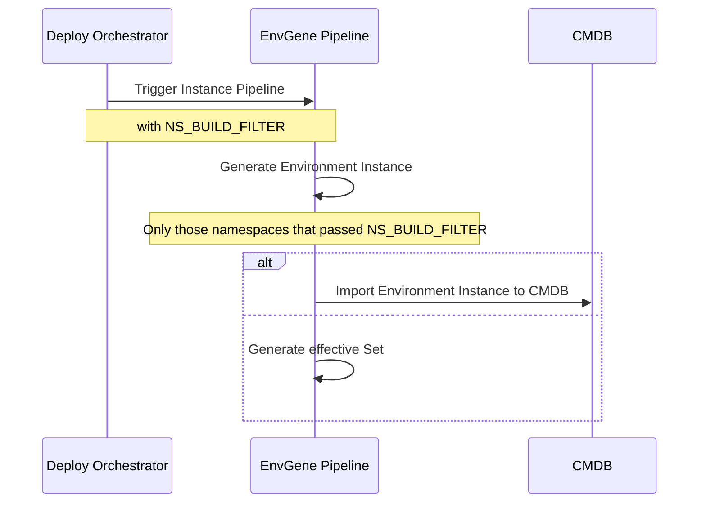

# Blue-Green Deployment

- [Blue-Green Deployment](#blue-green-deployment)
  - [Problem Statement](#problem-statement)
  - [Proposed Approach](#proposed-approach)
    - [BG Related EnvGene objects](#bg-related-envgene-objects)
    - [Namespace Render Filter](#namespace-render-filter)
    - [`bg_manage` Job](#bg_manage-job)
    - [BG Related Instance Pipeline Parameters](#bg-related-instance-pipeline-parameters)
    - [BG State Files](#bg-state-files)
      - [Validation Algorithm](#validation-algorithm)
    - [Warmup operation](#warmup-operation)
    - [CMDB Import](#cmdb-import)
    - [BG Related Parameters in Effective Set](#bg-related-parameters-in-effective-set)
    - [BG Related Macros](#bg-related-macros)
    - [Use Cases](#use-cases)

## Problem Statement

EnvGene currently lacks support for Blue-Green Deployment (BGD), which is a deployment strategy that reduces downtime by running two identical production environments called Blue and Green.

## Proposed Approach

The sequence shows the Blue-Green (BG) operation flow where the BG Operator initiates operations through the BG Plugin, which triggers the EnvGene Instance pipeline. The pipeline's `bg_manage` job validates state transitions, manages BG state files in the Instance repository, and copies the namespace and child objects during the warmup operation.



Following sequence describes the deploy operation in the BG case. The deploy orchestrator triggers EnvGene, specifying `NS_BUILD_FILTER` for selective namespace processing.



> [!NOTE]
>
> BG Operator, BG Plugin, and CMDB are not components of EnvGene.
> They are conceptual external systems that interact with EnvGene as part of the blue-green deployment operations.

The following functionality is used in these scenarios:

- EnvGene stores BG domain configuration as a [BG Domain](/docs/envgene-objects.md#bg-domain) object
- EnvGene generates a [BG Domain](/docs/envgene-objects.md#bg-domain) from a [BG Domain Template](/docs/envgene-objects.md#bg-domain-template) as part of Environment Instance generation
- EnvGene validates that namespaces referenced in the BG Domain object exist in the Environment during Environment Instance generation
- EnvGene is able to generate particular [Namespaces](/docs/envgene-objects.md#namespace) only of Environment using [Namespace Render Filter](#namespace-render-filter) feature
- EnvGene provides parameters describing BG domain in [Effective Set](/docs/calculator-cli.md#version-20topology-context-bg_domain-example)
- EnvGene creates, updates and validates [BG state files](#bg-state-files) for peer and origin namespaces, based on BG Plugin call
- EnvGene supports the [warmup operation](#warmup-operation) by copying [Namespace](https://github.com/Netcracker/qubership-envgene/blob/main/docs/envgene-objects.md#namespace) and [Application](https://github.com/Netcracker/qubership-envgene/blob/main/docs/envgene-objects.md#application) for origin/peer
- EnvGene [imports](#cmdb-import) the BG domain object into CMDB

### BG Related EnvGene objects

- [BG Domain](https://github.com/Netcracker/qubership-envgene/blob/main/docs/envgene-objects.md#bg-domain): Configuration object that defines domain structure
- [BG Domain Template](https://github.com/Netcracker/qubership-envgene/blob/main/docs/envgene-objects.md#bg-domain-template): Template used to generate BG Domain object during Environment Instance generation. During Environment Instance generation, EnvGene validates that all namespaces referenced in the generated BG Domain object (origin, peer, and controller namespaces) actually exist in the Environment. If any referenced namespace is missing, the generation fails with a validation error.
- [BG State Files](/docs/envgene-objects.md#bg-state-files): Files that track origin and peer namespace states

### Namespace Render Filter

The Namespace Render Filter allows EnvGene to generate only selected [Namespaces](/docs/envgene-objects.md#namespace) when generation an Environment Instance. This enables targeted processing of specific namespaces based on their names or Blue-Green Namespace aliases, rather than generating the full Environment.

For details, see: [Namespace Render Filter](/docs/features/namespace-render-filtering.md)

### `bg_manage` Job

This job is part of the Instance pipeline and does the following:

- Validates namespace names in `BG_STATE` against the [BG Domain](/docs/envgene-objects.md#bg-domain) object in the Environment Instance
- Validates BG states received in `BG_STATE` against BG state files in the repository
- Creates/updates [BG state files](/docs/envgene-objects.md#bg-state-files)
- During warmup, copies [Namespace](https://github.com/Netcracker/qubership-envgene/blob/main/docs/envgene-objects.md#namespace) and [Applications](https://github.com/Netcracker/qubership-envgene/blob/main/docs/envgene-objects.md#application) under it

The criteria for running this job and its order relative to other jobs are described in [envgene-pipelines](/docs/envgene-pipelines.md).

### BG Related Instance Pipeline Parameters

- [`ENV_NAMES`](https://github.com/Netcracker/qubership-envgene/blob/main/docs/instance-pipeline-parameters.md#env_names)
- [`BG_MANAGE`](/docs/instance-pipeline-parameters.md#bg_manage)
- [`BG_STATE`](/docs/instance-pipeline-parameters.md#bg_state)
- [`GH_ADDITIONAL_PARAMS`](/docs/instance-pipeline-parameters.md#gh_additional_params)

The set of parameters differs between GitLab and GitHub EnvGene pipelines.

**GitLab CI Example:**

```yaml
variables:
  ENV_NAMES: "sdp-dev/env-1"
  BG_MANAGE: "true"
  BG_STATE: "{\"controllerNamespace\":\"bss-controller\",\"originNamespace\":{\"name\":\"bss-origin\",\"state\":\"active\",\"version\":\"v2.1.0\"},\"peerNamespace\":{\"name\":\"bss-peer\",\"state\":\"candidate\",\"version\":\"v2.2.0\"},\"updateTime\":\"2024-01-15T10:30:00Z\"}"
```

**GitHub Actions Example:**

```yaml
ENV_NAMES: "sdp-dev/env-1"
GH_ADDITIONAL_PARAMS: "BG_MANAGE=true,BG_STATE={\"controllerNamespace\":\"bss-controller\",\"originNamespace\":{\"name\":\"bss-origin\",\"state\":\"active\",\"version\":\"v2.1.0\"},\"peerNamespace\":{\"name\":\"bss-peer\",\"state\":\"candidate\",\"version\":\"v2.2.0\"},\"updateTime\":\"2024-01-15T10:30:00Z\"}"
```

`INSTANCE_PIPELINE_PARAMETERS` deployment parameter should be passed along with BG_STATE and BG_MANAGE parameters while triggering Envgene pipeline.

For example,

If `INSTANCE_PIPELINE_PARAMETERS` is set with ENV_NAMES: sdp-dev/env-1,  CMDB_IMPORT: "true", DEPLOYMENT_TICKET_ID: "FAKE-000", the plugin should trigger Envgene pipeline with below parameters

```yaml
variables:
  ENV_NAMES: "sdp-dev/env-1"
  BG_MANAGE: "true"
  BG_STATE: "{\"controllerNamespace\":\"bss-controller\",\"originNamespace\":{\"name\":\"bss-origin\",\"state\":\"active\",\"version\":\"v2.1.0\"},\"peerNamespace\":{\"name\":\"bss-peer\",\"state\":\"candidate\",\"version\":\"v2.2.0\"},\"updateTime\":\"2024-01-15T10:30:00Z\"}"
  CMDB_IMPORT: "true"
  DEPLOYMENT_TICKET_ID: "FAKE-000"
```

### BG State Files

BG state files track the current state of origin and peer namespaces in a Blue-Green Domain. BG state files indicate which namespace is currently active, idle, candidate, or in a legacy state during BG operations. BG state files are empty marker files created and updated by the `bg_manage` job to track BG lifecycle transitions. When a state changes, the old state file is removed and a new one is created with the updated state.

**Storage Locations**:

- Environment root: `<cluster-name>/<environment-name>/`

**Naming Pattern**: `.<role>-<state>`

- **Roles**: `origin`, `peer`
- **States**: `active`, `idle`, `candidate`, `legacy`, `failedw`, `failedc`

**Examples**:

- `.origin-active` - Origin namespace is currently serving traffic
- `.peer-candidate` - Peer namespace is prepared for promotion
- `.origin-legacy` - Origin namespace was demoted after promotion
- `.peer-idle` - Peer namespace is not in use
- `.peer-failedw` - Peer namespace warmup operation failed
- `.origin-failedc` - Origin namespace commit/promote operation failed

#### Validation Algorithm

The `bg_manage` job checks that Blue-Green Domain state transitions are correct, using a state machine with a fixed set of allowed transitions.

**How Validation Works:**

1. **Validate Namespace Names:**
   The job validates that namespace names specified in `BG_STATE` match the corresponding namespaces defined in the [BG Domain](/docs/envgene-objects.md#bg-domain) object:
   - `BG_STATE.originNamespace.name` must match `bg_domain.originNamespace.name`
   - `BG_STATE.peerNamespace.name` must match `bg_domain.peerNamespace.name`
   - `BG_STATE.controllerNamespace` must match `bg_domain.controllerNamespace.name`
   - If any namespace name does not match, the job fails with an error message.

2. **Detect Current State:**
   The job looks for files like `.origin-<state>` and `.peer-<state>` in the environment root folder to determine the current states of the origin and peer namespaces.

3. **Read Target State:**
   It reads the desired new states from the `BG_STATE` parameter, which is provided as a JSON string.

4. **Check Allowed Transitions:**
   Using a table of allowed transitions (see below), it checks if moving from the current state to the target state is permitted.

5. **Validate:**
   If the transition is allowed, the job continues. If not, it stops and shows an error message explaining why the transition is invalid.

**Allowed State Transitions:**

| Current State         | Allowed Next States                        | Operation                                |
|---------------------- |------------------------------------------- |------------------------------------------|
| `(ACTIVE, NONE)`      | `(ACTIVE, IDLE)`                           | Init domain                              |
| `(ACTIVE, IDLE)`      | `(ACTIVE, CANDIDATE)`, `(ACTIVE, FAILEDW)` | Warmup, Warmup failure                   |
| `(ACTIVE, IDLE)`      | `(ACTIVE, IDLE)`                           | TBD                                      |
| `(ACTIVE, CANDIDATE)` | `(LEGACY, ACTIVE)`, `(ACTIVE, FAILEDC)`    | Promote, Promote failure                 |
| `(LEGACY, ACTIVE)`    | `(IDLE, ACTIVE)`, `(FAILEDC, ACTIVE)`      | Commit, Rollback failure                 |
| `(IDLE, ACTIVE)`      | `(CANDIDATE,ACTIVE)`, `(FAILEDW,ACTIVE)`   | Reverse warmup, Reverse Warmup failure   |
| `(CANDIDATE, ACTIVE)` | `(ACTIVE, LEGACY)`, `(FAILEDC, ACTIVE)`    | Reverse Promote, Reverse Promote failure |
| `(ACTIVE, LEGACY)`    | `(ACTIVE, IDLE)`, `(ACTIVE, FAILEDC)`      | Reverse Commit, Rollback failure         |

**Explanation of Terms:**

- `ACTIVE`, `IDLE`, `CANDIDATE`, `LEGACY`, `FAILEDW`, `FAILEDC` are possible states for origin and peer namespaces.
- `NONE` means no state file exists for that namespace. For example, `(ACTIVE, NONE)` means origin is active and peer namespace has no state file yet (initial state before domain init).
- For example, `(ACTIVE, IDLE)` means origin is active and peer is idle.
- The table shows which new state pairs are allowed from each current state pair, and what operation causes the transition.

If you try to make a transition that is not in the table, the job will fail.

### Warmup operation

Unlike other BG operations, during `warmup` (forward flow) or `reverse warmup` (reverse flow) the contents of namespaces are copied.

The `bg_manage` job syncs the namespace folders in the repository: it replaces the content of the candidate namespace folder with the content from the active namespace folder (including all nested `Application` objects and their files), **but keeps the `name` attribute from the candidate namespace.**

As a result, the active and candidate namespace folders become identical (except for the `name` attribute).

Additionally, during the warmup operation, the `bg_manage` job updates the Environment Inventory (`env_definition.yml`):

- **Forward flow (warmup)**: Copies `envTemplate.bgNsArtifacts.origin` → `envTemplate.bgNsArtifacts.peer`
- **Reverse flow (reverse warmup)**: Copies `envTemplate.bgNsArtifacts.peer` → `envTemplate.bgNsArtifacts.origin`

This ensures that the candidate namespace will use the same template artifact version as the active namespace when it becomes active.

### CMDB Import

The CMDB Import feature creates, among other entities such as Cloud or Namespace the [Blue Green Domain](https://github.com/Netcracker/qubership-envgene/blob/main/docs/envgene-objects.md#bg-domain) in the CMDB.

To do this, run the instance pipeline with the `CMDB_IMPORT: true` pipeline parameter.

> [!NOTE]
>
> Integration with a CMDB system is not part of EnvGene Core

### BG Related Parameters in Effective Set

When a BG Domain object is part of Environment Instance, EnvGene automatically adds BG-specific parameters to the Effective Set.

In this process, it replaces the credentials reference with the actual credentials value and removes the `credentials` attribute. The credentials must be of type `usernamePassword`.

**Topology Context (`parameters.yaml`):**

```yaml
bg_domain:
  name: sdp-dev-env-1-bg-domain
  type: bgdomain
  originNamespace:
    name: env-1-origin
    type: namespace
  peerNamespace:
    name: env-1-peer
    type: namespace
  controllerNamespace:
    name: env-1-controller
    type: namespace
    url: https://controller-env-1-controller.qubership.org
```

**Topology Context (`credentials.yaml`):**

```yaml
bg_domain:
  controllerNamespace:
    username: user-placeholder-123
    password: pass-placeholder-123
```

Please refer to the [Effective Set](/docs/features/calculator-cli.md#version-20topology-context-bg_domain-example) documentation for more details.

### BG Related Macros

Some Template calculator CLI macros are calculated based on the BG domain object:

- [`ORIGIN_NAMESPACE`](/docs/template-macros.md#origin_namespace)
- [`PEER_NAMESPACE`](/docs/template-macros.md#peer_namespace)
- [`CONTROLLER_NAMESPACE`](/docs/template-macros.md#controller_namespace)
- [`BG_CONTROLLER_URL`](/docs/template-macros.md#bg_controller_url)
- [`BG_CONTROLLER_LOGIN`](/docs/template-macros.md#bg_controller_login)
- [`BG_CONTROLLER_PASSWORD`](/docs/template-macros.md#bg_controller_password)
- [`BASELINE_ORIGIN`](/docs/template-macros.md#baseline_origin)
- [`BASELINE_PEER`](/docs/template-macros.md#baseline_peer)
- [`BASELINE_CONTROLLER`](/docs/template-macros.md#baseline_controller)
- [`PUBLIC_IDENTITY_PROVIDER_URL`](/docs/template-macros.md#public_identity_provider_url)
- [`PRIVATE_IDENTITY_PROVIDER_URL`](/docs/template-macros.md#private_identity_provider_url)

### Use Cases

Use cases for the `bg_manage` job are detailed in the [BG Operation in EnvGene Job](/docs/use-cases/blue-green-deployment.md).
